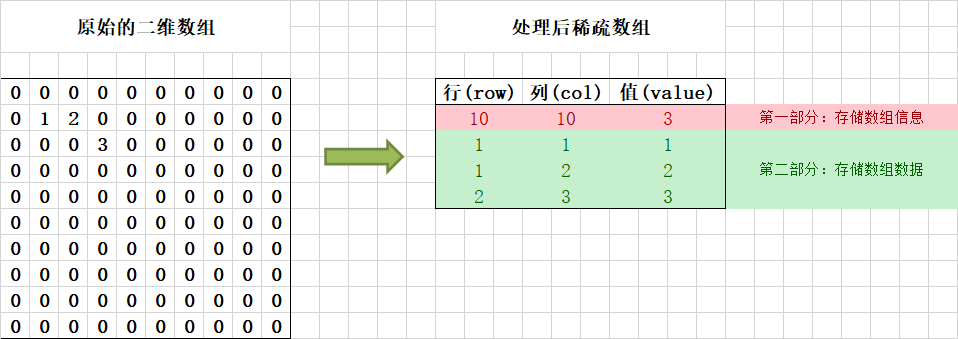

数组是最基础的数据结构，也是两大物理存储结构之一，只有深刻理解了数组的概念和特性，才能算是迈入学习数据结构的殿堂，才能将抽象的数据结构映射到代码当中。

<!--more-->

## 理解数组

数组本质上是一种 **线性表** 数据结构，它用一组 **连续的内存空间**，来存储一组具有 **相同类型的数据**。

### 线性表


如上图所示，线性表就是数据排成一条线一样的结构，在线性表中，每个数据都只有前后两个方向。

与线性表相对的是非线性表结构，在非线性表中，每个数据会存在多个方向，数据之间不仅仅只是简单的前后关系，而是呈现发散型的关系。

### 连续的内存空间

在数组中，存储数据的内存空间是连续的。

也就是说，当一段内存空间标明用于存储数组元素，则这一片空间只会存储数组元素，不会再拆分出来存储其他的数据。

### 相同类型的数据

在数组的原始定义中，数组只能存储相同类型的数据，这样可以保证数组中每个元素占用的内存空间都能保持一致。

## 数组的增删查改

讨论数组的增删查改，从效率的角度上区分，主要可以分为两类：高效存取、低效增删。

### 高效存取

这里的“存取”指的是通过下标访问数组元素，然后对这个元素做存取操作。

数组能做到高效存储的根本原因在于，其拥有“连续的内存空间”和“相同类型的数据”这两个限制。正因为这两个限制，计算机可以通过一个寻址公式来寻找数组元素的地址，如下是寻址公式的简单理解：

```c
address[i] = base_address + data_type_size * i
```

其中，`base_address` 表示数组的起始地址，`data_type_size` 表示每个元素占用的空间大小。

简单的理解就是，由于存储数组元素的内存空间是连续的，因此可以使用一个相对于起始位置的偏移量即可找到数组元素，又因为数组中存储的都是相同类型的元素，可以采用下标计算每一个元素的相对偏移量。

通过寻址公式，数组可以通过下标快速查找到数组中的元素，其时间复杂度能达到 $O(1)$。

### 低效增删

虽然数组可以通过下标实现高效的随机存取，但是对数组做插入、删除操作非常低效。

这里的低效体现在插入元素或删除元素之后，需要对数组中的其他元素做搬移操作，以保证数组元素的连续性。

在一个长度为 n 的数组中，假设要在第 k 个位置插入一个元素，这不是修改元素的操作，不能直接替换掉第 k 个元素，而是需要依次将第 k 个及之后的元素都往后挪一位，然后才能在第 k 个位置上存入这个元素。

删除元素和插入元素类似，为了避免删除元素之后导致数组中间出现空洞，需要将删除位置之后的元素往前挪一位。

通过计算得知，数组插入、删除元素的最好时间复杂度为 $O(1)$、最坏时间复杂度为 $O(n)$，平均时间复杂度为 $O(n)$。

## 特殊数组

### 二维数组

二维数组指的是以数组作为数组元素的数组，即“数组的数组”，又被称为矩阵。


从存储结构上看，将普通的一维数组看作是一个如同直线的线性表，二维数组就可以看作是多个线性表并排的平面。

### 稀疏数组

在数组中，若为 0 的元素数目远远多于非 0 元素，并且非 0 元素分布没有规律时，则可以用稀疏数组保存该数组的元素。



对于二维数组，行和列可以作为元素的坐标，通过坐标可以确定一个元素的位置，稀疏数组就是通过存储坐标和元素值以保证重新转换回二维数组。

稀疏数组通常是用作减少存储空间浪费，压缩数组规模，只保存有用数据。这是一个典型的时间换空间的应用。

## 常见问题

### 数组越界

虽然数组可以通过寻址公式做到高效随机访问，但是这并没有限制使用超出数组长度的下标访问数组，我们通常把访问的数组下标超出数组长度的情况称为数组越界。

在 C 语言中，编译器不会检测出数组越界的问题，如果出现数组越界的情况而又没处理的话，极可能出现如代码进入死循环等不可预知的情况。

```c
int main(int argc, char* argv[]) {
    int i = 0;
    int arr[3] = {0};
    for(; i<=3; i++){
        arr[i] = 0;
        printf("hello world\n");
    }
    return 0;
}
```

如上述代码，在字节对齐和内存分配的特性下，先后定义的 `i` 和 `arr` 共占据了 8 个字节，表现为 `{arr[0], arr[1], arr[2], i}` 的形式，当循环到下标为 `3` 时，实际 `arr[3]` 指向的就是 `i` 所在地址，会出现 `arr[3] = i = 3`，以至于代码运行进入死循环。

相比较下，使用 Java 会更加安全，Java 不会把检查数组越界的工作丢给程序员来做，其本身就会做越界检查，如果出现错误会抛出 `java.lang.ArrayIndexOutOfBoundsException` 异常，而不是出现死循环。

### 容器和数组

这里说的容器指的是封装了数组的操作方法、并且支持动态扩容的容器类，比如 Java 中的 `ArrayList` 类。

与原生数组相比，虽然 `ArrayList` 拥有非常大的优势，但并不是所有地方都使用 `ArrayList` 而不是数组，在某些情况下，使用数组会更方便、更有效率。

在以下情况下，可以选择原生数组：

- 追求极致性能。Java 的 `ArrayList` 不支持存储基本类型，而是存储基本类型封装后的对象，自动装箱、拆箱会有一定的性能消耗
- 操作简单，仅使用原生功能。虽然 `ArrayList` 提供了非常多额外的功能，但也额外增加了风险，使用原生数组更简单便捷

### 从 0 开始编号

数组的下标从 0 开始编号可以通过数组的寻址公式来回答。

在 C 语言中，数组的下标不是指数组的第几个元素，而是指数组元素的偏移。

如果使用 `0` 作为数组的起始下标，则可以使用下述的表达式作为寻址公式：

```c
address[i] = base_address + data_type_size * i
```

如果使用 `1` 作为数组的起始下标，将不能直接使用上面的寻址公式，而是需要修改如下：

```c
address[i] = base_address + data_type_size * (i - 1)
```

在对比前后两个寻址公式之后，使用 `1` 作为起始下标的寻址公式会比使用 `0` 作为起始下标的寻址公式多一个简单的减法指令。

对于非常底层的程序来说，即使只是多出一个简单的减法指令，也是一种性能的损耗，为了做到极致优化，选择 `0` 作为起始下标会更好。

当然还有一个历史原因，C 语言使用了 `0` 作为数组的起始下标，后续出现的编程语言都纷纷仿效，这也算是为了统一，降低程序员的学习成本。

