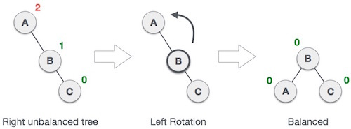
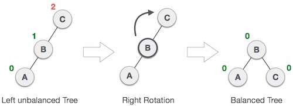

AVL 树是最早被发明的自平衡的二叉查找树，在 AVL 树中，任意结点的两个子树的高度最大差别为 1，所以它也被称为高度平衡树，其本质仍然是一颗二叉查找树。

<!--more-->

## 基本概念

结合二叉查找树的特性，以及 AVL 树自身的特性，AVL 树具有以下特性：

- 若任意结点的左子树不为空，则左子树上所有结点的值均小于它的根结点的值
- 若任意结点的右子树不为空，则右子树上所有结点的值均大于或等于它的根结点的值
- 任意结点的左、右子树也分别为二叉查找树
- 任意结点的子树的高度差都小于等于 1

上述的前三项是二叉查找树的特性，第四项是 AVL 树自平衡的特性。

## 实现原理

为了保证二叉树的平衡，AVL 树引入了监督机制，就是在树的某一部分的不平衡度超过一个阈值后触发相应的平衡操作，保证树的平衡度在可以接受的范围内。

既然引入了监督机制，则必然需要一个监督指标，以此来判断是否需要进行平衡操作，这个监督指标被称为 **平衡因子**（Balance Factor）。其定义如下：

> 某个结点的右子树的高度减去左子树的高度得到的差值。

基于平衡因子，就可以这样定义 AVL 树：

> 所有结点的平衡因子的绝对值都不超过 1 的二叉查找树。

为了计算平衡因子，自然需要在结点中引入高度这一属性。结点的高度为以下定义：

> 左右子树的高度的最大值。

```c
typeof struct AVLNode {
    struct AVLNode *left;       // 左子树
    struct AVLNode *right;      // 右子树
    int height;                 // 当前结点的高度
    int value;                  // 当前结点的值
}
```

## 自平衡

自平衡是指在对平衡二叉树执行插入或删除结点操作后，可能会导致树中某个结点的平衡因子绝对值超过 1，即平衡二叉树变得“不平衡”，为了恢复该结点左右子树的平衡，此时需要对结点执行旋转操作。

二叉树的平衡化有两大基础操作：左旋和右旋。左旋，即是逆时针旋转；右旋，即是顺时针旋转。

这两种操作都是从失去平衡的最小子树根结点开始的（即离插入结点最近且平衡因子超过 1 的祖结点）。

### 左旋



所谓左旋操作，就是把上图中的 B 结点和 A 结点进行所谓“父子交换”。在仅有这三个结点时候，是十分简单的。但是当 B 结点处存在左孩子时，事情就变得有点复杂了。

通常的操作是：**结点 B 抛弃左孩子，将之与旋转后的结点 A 相连，成为结点 A 的右孩子。**

### 右旋



所谓右旋操作，就是把上图中的 B 结点和 C 结点进行所谓“父子交换”。在仅有这三个结点时候，也是是十分简单的。但是当 B 结点处存在右孩子时，事情就变得有点复杂了。

这时通常的操作是：**结点 B 抛弃右孩子，将之和旋转后的结点 C 相连，成为结点 C 的左孩子。**

### 单次旋转 - LL


LL 型又被称为“左左”，从上图中可以看得出，A 结点的平衡因子绝对值达到了 2，需要进行修复才能重新成为一棵平衡二叉树。F 结点为新插入的结点，优先会经过 A 结点的 **左孩子** B 结点，最终落到 B 结点的 **左子树** 上，这即是“左左”的来由。

可以使用平衡因子来定义 LL 情况：A 结点的平衡因子为 -2，左孩子 B 结点的平衡因子为 -1。

这时候仅需要对 A 结点做一次 **右旋** 的操作即可达到平衡状态：


### 单次旋转 - RR

RR 型又被称为“右右”，与上面的 LL 型 具有对称性，展示的情况如下：


也可以使用平衡因子来定义：A 结点的平衡因子为 2，右孩子 C 结点的平衡因子为 1。

这里则是仅需要对 A 结点做一次 **左旋** 的操作即可达到平衡状态：


### 双次旋转 - LR

使用平衡因子定义 LR 型为：A 结点的平衡因子为 -2，左孩子 B 结点的平衡因子为 1。

下面有一个例子：


第一步：对 A 结点的左子结点（B 结点）执行左旋操作，得到一个 LL 型的结构：


第二步：对 A 结点执行右旋操作：


### 双次旋转 - RL

RL 型和上面的 LR 型对称，A 结点的平衡因子为 2，右孩子 C 结点的平衡因子为 -1。


第一步：对 A 结点的右子结点（C 结点）执行右旋操作，得到一个 RR 型的结构：


第二步：对 A 结点执行左旋操作：


