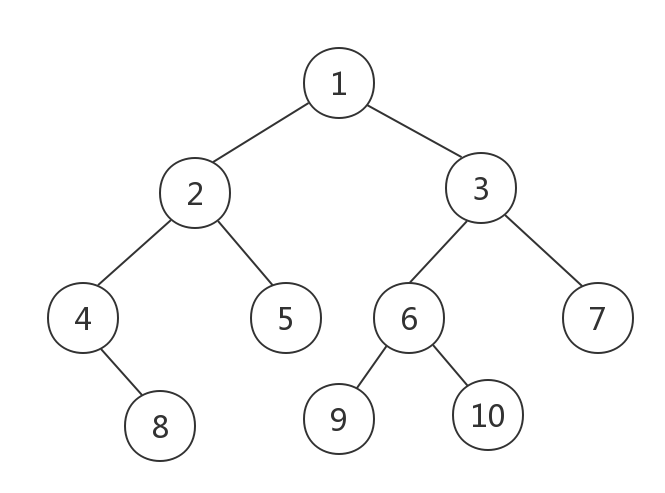

二叉树是树形结构的一种重要类型，许多实际问题抽象出来的数据结构往往是二叉树形式，即使是一般的树也能简单地转换为二叉树，因此二叉树显得格外重要。

<!--more-->

## 树的定义



树是一种抽象数据类型，用来模拟具有树状结构性质的数据集合，如上图就是一个树形结构。

树的专业术语比较多，需要了解以下内容：

* 树的结点：包含一个数据元素及若干指向子树分支的信息
* 结点的度：一个结点含有的子树数目称为该结点的度
* 树的度：树中最大的结点度称为树的度
* 叶子结点：也称终端结点，结点度为零的结点
* 分支结点：也称非终端结点，结点度不为零的结点
* 子结点：一个结点含有的子树的根结点称为该结点的子结点
* 父结点：若一个结点含有子结点，则这个结点称为其子结点的父结点
* 兄弟结点：具有相同父结点的结点互称为兄弟结点
* 堂兄弟结点：父结点在同一层的结点互为堂兄弟结点
* 结点的祖先：从根到该结点所经分支上的所有结点称为该结点的祖先
* 子孙：以某结点为根的子树中任一结点都称为该结点的子孙
* 结点的层次：从根开始定义起，根为第 1 层，根的子结点为第 2 层，以此类推
* 深度：对于任意结点 n，n 的深度为从根到 n 的唯一路径长，根的深度为 0
* 高度：对于任意结点 n，n 的高度为从 n 到叶子结点的最长路径长，所有叶子结点的高度为 0
* 森林：由 m(m>=0) 棵互不相交的树组成的集合称为森林

## 常见二叉树

顾名思义，二叉是指每个结点最多只有两个子结点，这两个子结点分别称为左子结点和右子结点。

但是，二叉树并不要求所有结点必须拥有两个子结点，有的结点只有左子结点，有的结点只有右子结点。

### 满二叉树


如上述图 a 所示，除叶子结点以外，所有非叶子结点都有 2 个子结点，这种二叉树被称为满二叉树。

### 完全二叉树

如上述图 b 所示，除最后一层外，每一层的结点数均达到最大值，而且最后一层的叶子结点都靠左排列，只缺少右边的若干结点，这种二叉树被称为完全二叉树。

从定义上来说，满二叉树是一种特殊的完全二叉树。

### 二叉查找树


二叉查找树是一种特殊的二叉树，常用作搜索使用，也被称为二叉搜索树、二叉排序树。

它有可能是一棵空树，也可能是具有以下性质的二叉树：

* 若根结点的左子树不空，则左子树上所有结点的值均小于根结点的值
* 若根结点的右子树不空，则右子树上所有结点的值均大于等于根结点的值
* 根结点的左、右子树也分别为二叉查找树

二叉查找树是一种经典的数据结构，它既具有链表快速插入、删除的特点，又具有数组快速查找的优势。

## 存储结构

### 链式存储

使用链表存储树的结构是一种比较简单、直观的方法。

二叉树中每个结点最多只有两个子结点，因此，可以给结点设计一个数据域和两个指针域，两个指针域分别指向左子结点和右子结点。


这种情况下，使用链表作为存储方式，只要拎住根结点，就可以通过左右子结点的指针，把整棵树都串起来。

这种方式比较常用，大部分二叉树代码都是通过这种方式实现的。

### 顺序存储

二叉树的顺序存储结构是基于数组实现的，用一维数组存储二叉树中的结点，并且数组的下标能够体现出二叉树结点之间的逻辑关系。

在这个存储二叉树结点的数组中，为了使得后续的结点逻辑关系易于理解，下标为 0 的存储位置是不使用的。一般是把根结点存储在 i = 1 的位置上，它的左子结点存储在 2i = 2 的位置上、右子结点存储在 2i + 1 = 3 的位置上。以此类推，左子结点的左子结点存储在 2i = 4 的位置，它的右子结点存储在 2i + 1 = 5 的位置。


总结二叉树结点在数组中的逻辑关系：如果结点 x 存储在数组中下标为 i 的位置，则结点 x 的左子结点存储在数组中下标为 2i 的位置，右子结点存储在数组中下标为 2i+1 的位置。

可以发现，上述展示的是一个完全二叉树，使用数组存储完全二叉树时，除了下标为 0 的位置没有存储数据之外，其他的位置都会被填满了。

但如果是非完全二叉树，则会出现浪费数组中内存空间的情况。如下图所示：


因此，一般使用顺序存储结构存储完全二叉树，在这种情况下，相比较链式存储结构会更节省内存。

堆其实就是一种完全二叉树，最常用的存储方式就是数组。

## 二叉树的遍历

二叉树的遍历是指从根结点出发，按照某种次序依次访问二叉树中的所有结点，使得某个结点仅且被访问一次。

### 深度优先遍历

深度优先遍历方式是指尽可能深地搜索树的分支，即先遍历到叶子结点再更改搜索路径。

二叉树经典的深度优先遍历方式有三种：前序遍历、中序遍历、后序遍历。其中，前、中、后序，表示的是结点与它的左右子树结点遍历打印的先后顺序：

- 前序遍历是指，对于树中的任意结点来说，先打印这个结点本身，然后再打印它的左子树，最后打印它的右子树
- 中序遍历是指，对于树中的任意结点来说，先打印它的左子树，然后再打印这个结点本身，最后打印它的右子树
- 后序遍历是指，对于树中的任意结点来说，先打印它的左子树，然后再打印它的右子树，最后打印这个结点本身


其实，二叉树的前、中、后序遍历就是一个递归的过程。比如，前序遍历就是先打印根结点，然后再递归地打印左子树，最后递归地打印右子树。

下述是递归实现前、中、后序遍历的伪代码展示：

```c
void preOrder(Node* root) {
    if (root == null) return;
    // 打印根结点
    print root;
    // 递归打印左子树
    preOrder(root->left);
    // 递归打印右子树
    preOrder(root->right);
}

void inOrder(Node* root) {
    if (root == null) return;
    // 递归打印左子树
    inOrder(root->left);
    // 打印根结点
    print root;
    // 递归打印右子树
    inOrder(root->right);
}

void postOrder(Node* root) {
    if (root == null) return;
    // 递归打印左子树
    postOrder(root->left);
    // 递归打印右子树
    postOrder(root->right);
    // 打印根结点
    print root;
}
```

除了使用递归的方式实现深度优先遍历外，还可以使用栈这种数据结构以非递归方式实现，前序遍历方式如下：


1. 将 A 结点压入栈中，栈的结构是 [A]；
2. 将 A 结点弹出，然后将 A 结点的子结点 B、C 压入栈中，栈的结构是 [C, B]；
3. 将 B 结点弹出，然后将 B 结点的子结点 D、E 压入栈中，栈的结构是 [C, E, D]；
4. 将 D 结点弹出，D 结点没有子结点，无需做处理，栈的结构是 [C, E]；
5. 将 E 结点弹出，E 结点没有子结点，无需做处理，栈的结构是 [C]；
6. 依次类推，最终以 A、B、D、E、C、F、G 的次序弹出结点元素。

### 广度优先遍历

广度优先遍历又称为层次遍历，从上往下对每一层依次访问，在每一层中，从左往右（也可以从右往左）访问结点，访问完一层再访问下一层。

层次遍历需要使用到队列这种数据结构，队列的特点是先进先出。整个遍历过程如下：

1. 将 A 结点入队，队列的结构是 [A]；
2. 将 A 结点出队，然后将 A 结点的子结点 B、C 入队，队列的结构是 [B, C]；
3. 将 B 结点出队，然后将 B 结点的子结点 D、E 入队，队列的结构是 [C、D、E]；
4. 将 C 结点出队，然后将 C 结点的子结点 F、G 入队，队列的结构是 [D、E、F、G\]；
5. 将 D 结点出队，D 结点没有子结点，无需做处理，栈的结构是 [E、F、G\]；
6. 以此类推，最终 A、B、C、D、E、F、G 的次序弹出结点元素。

### 优缺点

对于深度优先遍历算法，都是优先搜索完一颗子树，有着内存占用相对较小的优点，通常额外存储结点数是树的深度；非递归的深度优先遍历方式会进行回溯，相对效率比较低。

对于广度优先遍历算法，对于解决最短或最小问题特别有效，而且结点只访问一遍，效率相对较高；使用广度优先算法需要存储一层结点的状态，内存占用相对较高。

