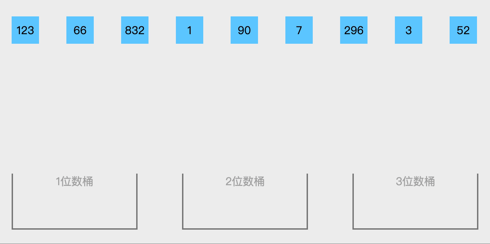

桶排序是计数排序的一种扩展使用，适用于元素值范围不大的序列。如果对大量学生的考试成绩做排序，就非常适合使用桶排序。

<!--more-->

## 详细描述

桶排序的工作原理是，将序列中的元素分配到有限的桶里，每个桶再分别进行排序（使用别的排序算法或者递归使用桶排序），最终合并成结果序列。

桶排序详细的执行步骤如下：

1. 找出序列中最小的元素和最大的元素，并计算得到差值范围和映射范围，确定桶的数量；
2. 遍历整个序列，将每一个元素移动到对应的桶中；
3. 对每一个桶中的元素进行排序，直到所有的桶中元素都有序；
4. 合并每一个桶中的元素成为有序序列。

## 算法图解

​

## 问题解疑

### 桶排序的关键是什么？

桶排序过程中存在两个关键环节：元素到桶的映射规则、排序算法选择。

对于映射规则，如果规则设计过于模糊、宽泛，可能所有元素都映射到同一个桶，导致桶排序往比较类排序算法演变；如果规则设计过于严苛，可能每一个桶只分配到一个元素，导致桶排序往计数排序方式演变。

对于桶中元素的排序，可以继续使用桶排序或者其他排序算法，最终桶排序的复杂度和稳定性，都根据排序算法的选择有所不同。

### 桶排序的适用于什么场景？

最好时间复杂度的场景是：序列中的元素值范围越小越好，比如对范围只有 10 的序列做排序，申请 10 个桶就能实现遍历一次序列完成排序。

最好空间复杂度的场景是：序列中的元素值均匀分布，最终分配到每一个桶的元素数量都相差不大，这样可以避免数据倾斜的问题。

## 代码实现

### 排序接口

```java
package cn.fatedeity.algorithm.sort;

/**
 * 排序接口
 */
public interface Sort {
    int[] sort(int[] numbers);
}
```

### 排序抽象类

```java
package cn.fatedeity.algorithm.sort;

/**
 * 排序抽象类
 */
public abstract class AbstractSort implements Sort {
    protected void swap(int[] numbers, int src, int target) {
        int temp = numbers[src];
        numbers[src] = numbers[target];
        numbers[target] = temp;
    }
}
```

### 桶排序类

```java
package cn.fatedeity.algorithm.sort;

import java.util.ArrayList;
import java.util.List;

/**
 * 桶排序类
 */
public class BucketSort extends AbstractSort {
    private void swap(List<Integer> numbers, int src, int target) {
        int temp = numbers.get(src);
        numbers.set(src, numbers.get(target));
        numbers.set(target, temp);
    }

    private void insertSort(List<Integer> numbers) {
        for (int i = 1; i < numbers.size(); i++) {
            for (int j = i; j > 0; j--) {
                if (numbers.get(j - 1) <= numbers.get(j)) {
                    break;
                }
                this.swap(numbers, j, j - 1);
            }
        }
    }

    @Override
    public int[] sort(int[] numbers) {
        if (numbers.length <= 1) {
            return numbers;
        }

        int min = numbers[0], max = numbers[0];
        for (int number : numbers) {
            if (number < min) {
                min = number;
            } else if (number > max) {
                max = number;
            }
        }

        // 以 10 为步长
        int bucketNum = (max - min) / 10 + 1;
        List<List<Integer>> bucketList = new ArrayList<>();
        for (int i = 0; i < bucketNum; i++) {
            bucketList.add(new ArrayList<>());
        }

        // 将元素分配到桶中
        for (int number : numbers) {
            int index = (number - min) / 10;
            List<Integer> bucket = bucketList.get(index);
            bucket.add(number);
        }

        int index = 0;
        for (int i = 0; i < bucketNum; i++) {
            List<Integer> bucket = bucketList.get(i);
            this.insertSort(bucket);
            for (int number : bucket) {
                numbers[index++] = number;
            }
        }
        return numbers;
    }
}
```

