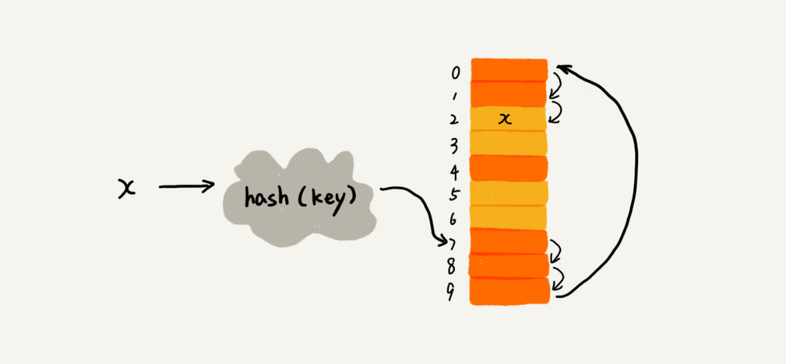
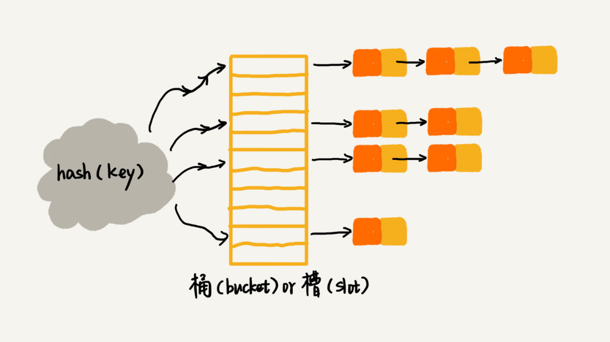
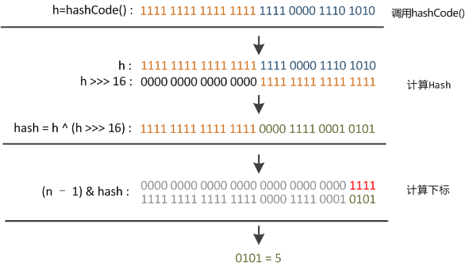

哈希表也被称为散列表，其实现使用到了散列技术，散列技术在理想情况下，无须任何比较就可以找到待查关键字，查找的效率非常高。

<!--more-->

## 哈希表的概念

散列技术在记录的存储位置和它的关键字之间建立一个确定的对应关系，使得每个关键字对应一个存储位置，也就是我们常说的键值对关系。

### 关键字

哈希表一般都是用在查找的时候，通常，我们将需要存储的原始数据被称作是查找的**关键字**。

### 哈希算法

散列技术的关键在于将关键字与存储位置建立对应关系，这种建立映射关系的规则被称作**哈希算法**。

一般的哈希算法是将任意长度的二进制值串映射为固定长度的二进制值串，而这个固定长度的二进制值串可以匹配上存储位置。

### 哈希值

通过原始数据映射之后得到的二进制值串就是**哈希值**。

### 装载因子

哈希冲突是非常常见的，因此，在此基础上增加了一个**装载因子**的概念，用来表示哈希表中空位的多少，其计算公式为：

```
哈希表的装载因子 = 填入表中的元素个数 / 哈希表的长度
```

装载因子越大，说明空闲位置越少，冲突越频繁，哈希表的性能会下降。

## 构造方法

哈希表利用了数组支持使用下标快速随机访问数据的特性，使用数组作为物理存储结构，可以理解为哈希表是数组的一种扩展，也可以说没有数组就没有哈希表。

哈希表通常是基于数组实现的，对比数组，哈希表还拥有创建、删除、查找都非常快的优势，无论数据量多大，这些操作都接近于 $O(1)$ 的时间复杂度；但相对也存在一些劣势，哈希表中的数据没有顺序，而且不能在同一存储地址存储重复的哈希值。

无论是什么编程语言，实现一个哈希表数据结构的过程都可以分为三个步骤：

1. 实现一个哈希算法；
2. 合理解决哈希冲突；
3. 实现其他操作方法。

## 哈希算法

一个好的哈希算法对于哈希表是非常重要的，是哈希表具有比较优的时间复杂度和空间复杂度的根本。

### 什么是好的哈希算法

简单来说，好的哈希算法需要具备两个原则：**快速计算**和**均匀分布**。

具体来说，实现一个好的哈希算法会有以下特点：

- 哈希算法的方向是单向的，从哈希值不能反向推导出原始数据
- 哈希算法的转换是敏感的，原始数据任何一点变动，得到的哈希值都会大不相同
- 哈希冲突的概率要极小的，不同的原始数据，经过哈希算法得到的哈希值相同的概率很小
- 哈希算法的执行效率是高效的，即使是很长的文本也能快速计算出哈希值

### 直接定址法

直接定址法就是取关键字的某个线性函数值作为哈希值，或者使用这个线性函数值经过特定的算法计算出哈希值。

例如，存储中国每一年的人数时，可以将年份作为计算哈希值的线性函数值，可以想象得到，年份是连续的，并且没有冲突，非常适合用来计算哈希值。

直接定址法的优点就是简单、分布均匀、不会出现冲突。其缺点也很明显，就是要求选定的线性函数值分布均匀、不会出现冲突。

换一种角度看，直接定址法的限制决定了其并不常用于实际开发。

### 数字分析法

数字分析法的核心点就是从原始数据中选取一个辨识度较大的数据作为计算哈希算法的关键字，比较常见的就是用于处理关键字位数比较大的数字。

数字分析法有个比较常见的场景，国内的手机号都是 11 位的数字，而且也常见到将中间 4 位数字隐藏的做法，这个其实就是数字分析法的一种用法。因为 11 位手机号的前 3 位是运营商接入号，中间 4 位是归属地识别号，后 4 位是用户号，当手机号码都在同一个地区时，只需要使用前 3 位和后 4 位就可以作为哈希算法的关键字。

数字分析法也是一种相对简单的哈希算法，但一般针对较大数字，如果这些较大数字分布均匀的话，可以选用这个方法。

### 平方取中法

平方取中法的规则如其名。假设关键字是 1234，计算得到它的平方就是 1522756，再抽取中间三位 227 可以作为哈希值；假设关键字是 4321，计算得到它的平方就是 18671041，抽取中间三位 671 或 710 作为哈希值即可。

平方取中法比较适合不知道关键字的分布、而位数又不是很大的情况。

### 折叠法

折叠法主要是将关键字从左到右分割成位数相等的几部分，然后将这几部分叠加求和，并根据哈希表的长度，取后几位作为哈希值。

比如，对 9876543210 使用折叠法，假设哈希表表长为三位，将 9876543210 分成 987|654|321|0 这样四组，然后对这四组使用 987+654+321+0 叠加求和计算得到 1962，再取 1962 的后三位作为哈希值。

折叠法的应用场景可以和平方取中法互补，适合用在不知道关键字的分布，而位数较多的情况。

### 除留取余法

除留取余法是最常用的哈希算法之一，实际就是对关键字求模取余数，这个余数就是哈希值。但是这种方法得到的哈希值非常容易冲突，这个方法的关键就是要选择合适的除数。

根据前辈们的经验，通常这个除数会选取小于等于哈希表表长的最大质数或不包含小于 20 质因子的合数。

> 合数是指在大于 1 的整数中除了能被 1 和本身整除外，还能被其他数（0 除外）整除的数，最小的合数是 4。
>
> 与之相对的是质数，在正整数中，1 既不属于质数也不属于合数。

## 哈希冲突

设计得再好的哈希算法也很难完全避免冲突，从哈希表出现到现在，也出现了很多解决哈希冲突的常规方法。

### 开放定址法

所谓开放定址法就是，一旦发生了冲突，就去寻找下一个空的存储地址，只要哈希表足够大，空的存储地址总能被找到，并将数据存入。

像是这种寻找下一个空的存储地址的常用方法就是线性探测法，即一个一个去寻找，直至找到下一个空的存储地址。但是这种方法在哈希冲突比较多的时候，哈希表的时间复杂度会慢慢下降到 $O(n)$。



除了线性探测法，还有二次探测、双重哈希的方法。

二次探测就是将线性探测为 1 的步长改成平方的步长。例如，在线性探测中是 hash(key) + 0, hash(key) + 1, hash(key) + 2，二次探测就是 hash(key) + 0, hash(key) + $1^2$、hash(key) + $2^2$。

双重哈希指的是使用多个哈希算法，如果第一个哈希算法出现冲突，就使用第二个哈希算法，以此类推，直至找到空闲的存储位置。

当数据量和装载因子都比较小的时候，适合采用开放寻址法。这也是 Java 中 ThreadLocalMap 使用开放寻址法解决散列冲突的原因。

### 链地址法

链地址法是另一种常见的哈希冲突解决办法。

开放定址法是在原哈希表上再次找到存储位置，而链地址法是在出现哈希冲突之后，将这些出现冲突的关键字存储到链表中。具体的存储结构如下图所示：



这个方法相对于开放定址法来说多了链表这种数据结构，对于会出现很多冲突的哈希算法来说，提供了绝不会出现找不到地址的保障。

虽然这个方法在插入时没有明显的性能损耗，但是带来了查找、删除时需要遍历单向链表的性能损耗。

链地址法在查找时耗费的时间取决于链表的长度，可以将时间复杂度理解成 $O(k)$(k 为链表长度)。

针对于这样的劣势，可以采用其他的数据结构代替链表，如使用红黑树这样的树形结构，Java 中的 HashMap 便是如此。

### 公共溢出区法

公共溢出区法可以理解为链地址法的集中方式。

公共溢出区法也是需要使用到另外的存储区域，但不像链地址法中会将这个存储区域链到链表上，而是使用一个单独的存储区域存储所有冲突的关键字。

这个公共的溢出区可以是另外一个哈希表，对冲突的关键字再次哈希进行存储。

## 应用场景

这里的应用场景可以分为哈希表的应用场景和哈希算法的应用场景。

对于哈希表，使用它主要是为了提升时间复杂度；对于哈希算法，使用它是为了应用它的特点。

### 安全加密

常见的加密算法使用的都是哈希算法，如 MD5、SHA 等。因为哈希算法不可逆和转换敏感的特点，使用哈希算法的安全性非常好。

### 唯一标识

比如 URL 字段或者图片字段要求不能重复，这个时候就可以通过对相应字段值做 MD5 处理，将数据统一为 32 位长度，对数据库索引构建和查询提升非常明显。

此外，还可以对文件之类的二进制数据做 MD5 处理，作为唯一标识，这样判定重复文件的时候更快捷。

### 数据校验

比如从网上下载的很多文件（尤其是 P2P 站点资源），都会包含一个 MD5 值，用于校验下载数据的完整性，避免数据在中途被劫持篡改。

### 负载均衡

利用哈希表代替映射表，可以实现一个会话粘滞的负载均衡策略。

对客户端 IP 地址或者会话 ID 计算哈希值，将取得的哈希值与服务器列表的大小进行取模运算，最终得到的值就应该是被路由到的服务器编号。

### 数据分片

通过哈希表对处理的海量数据进行分片，多机分布式处理，可以突破单机资源的限制。

## 经典案例

### MD5

MD5 消息摘要算法是一种被广泛使用的散列函数，可以产生出一个 128 位（16 字节）的散列值，用于确保信息传输完整一致。

MD5 是输入不定长度信息，输出固定长度 128 位的算法。无论是多长的信息，经过程序流程，都会生成四个 32 位数据，最后联合起来成为一个 128 位散列值。

但是在 2009 年，中国科学院的谢涛和冯登国仅用了 $22^{0.96}$ 的碰撞算法复杂度，破解了 MD5 的碰撞抵抗，该攻击在普通计算机上运行只需要数秒钟。2011 年，RFC 6151 禁止将 MD5 用作密钥散列消息认证码。

### SHA

安全散列算法 SHA 是一个密码散列函数家族，是 FIPS 所认证的安全散列算法。这是能计算出一个数字消息所对应到的、长度固定的字符串（又称消息摘要）的算法。且若输入的消息不同，它们对应到不同字符串的几率很高。

SHA 家族算法包含了 SHA-0、SHA-1、SHA-2、SHA-3，对 SHA-0 和 SHA-1 都已经出现理论上破解的方法，现在比较常见的还是 SHA-2，虽然至今尚未出现对 SHA-2 有效的攻击，但它的算法跟 SHA-1 基本上相似。

SHA-3 是在 2015 年正式发布的，由于对 MD5 出现成功的破解，NIST 感觉需要一个与之前算法不同的、可替换的加密散列算法，也就是现在的 SHA-3。

### CRC

循环冗余校验 CRC 是一种根据网络数据包或计算机文件等数据产生简短固定位数校验码的一种信道编码技术，主要用来检测或校验数据传输或者保存后可能出现的错误。它是利用除法及余数的原理来作错误侦测的。

由于 CRC 算法检验的检错能力极强，且检测成本较低，因此在对于编码器和电路的检测中使用较为广泛。从检错的正确率与速度、成本等方面，都比奇偶校验等校验方式具有优势。因而 CRC 成为计算机信息通信领域最为普遍的校验方式。

## 工业级哈希表实现

Java 中的 HashMap 是一个非常经典的工业级哈希表实现，理解它的实现可以加深对哈希表的印象，有兴趣可以看一下 HashMap 的源码。

### 初始大小

HashMap 默认的初始大小是 16，当然这个默认值是可以设置的，如果事先知道大概的数据量有多大，可以通过修改默认初始大小，减少动态扩容的次数，这样能大大提高 HashMap 的性能。

哈希表的容量要取 2 的整次幂，因为这样正好相当于一个**低位掩码**，在 `hash()` 方法内可以做到高位归零。

### 装载因子和动态扩容

HashMap 默认的最大装载因子是 0.75，当 HashMap 中元素个数超过 0.75 * capacity(capacity 表示哈希表的容量)的时候，就会启动扩容，每次扩容都会扩容为原来的两倍大小。

### 散列函数

散列函数的设计并不复杂，追求的是简单高效、分布均匀。HashMap 散列函数的源码如下：

```java
int hash(Object key) {
    int h = key.hashCode()；
    // capicity 表示哈希表的大小
    return (h ^ (h >>> 16)) & (capitity -1);
}
```

在 Java 中，`hashCode()` 方法通过将对象的物理地址转换为一个整数，再将整数通过哈希算法计算得到哈希码，这个哈希码是一个 32 位的带符号整数值，正常情况下很难发生碰撞。

为了让这个哈希码与 HashMap 的底层数组做映射，Java 还会将这个哈希码再次做哈希操作，采用的方法是：

1. 将哈希码右移 16 位，正好是 32bit 的一半；
2. 将哈希码的高半区和低半区做异或，可以混合哈希码的高位和低位，以此加大低位的随机性；
3. 将计算结果做高位归零，只保留低位值。



### 散列冲突解决方法

HashMap 底层采用链地址法来解决冲突。即使负载因子和散列函数设计得再合理，也免不了会出现拉链过长的情况，一旦出现拉链过长，则会严重影响 HashMap 的性能。

于是，在 JDK1.8 版本中，为了对 HashMap 做进一步优化引入了红黑树。

当链表长度太长（默认超过 8）时，链表就转换为红黑树，这是利用了红黑树快速增删改查的特点，提高 HashMap 的性能。

当红黑树结点个数少于 8 个的时候，又会将红黑树转化为链表，这是因为在数据量较小的情况下，红黑树要维护平衡，比起链表来，性能上的优势并不明显。

