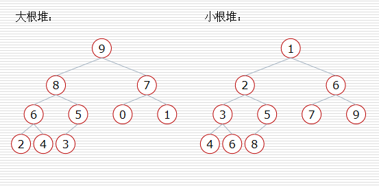
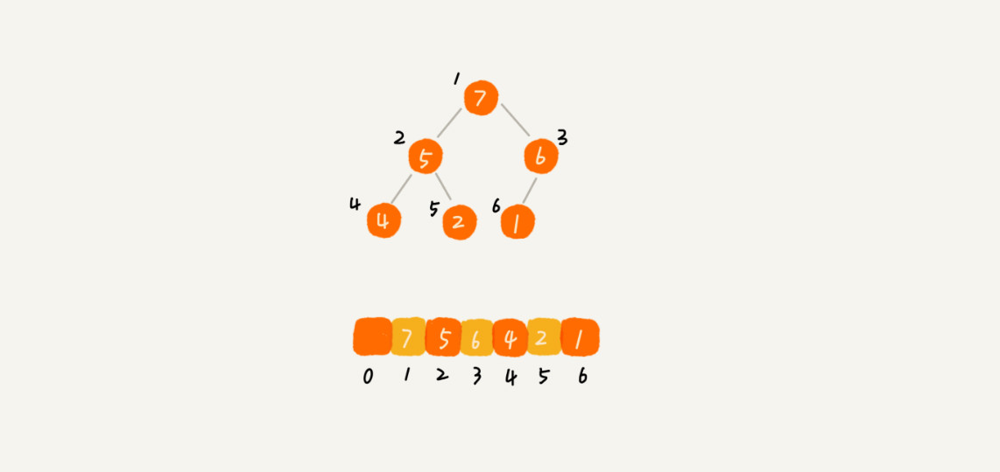
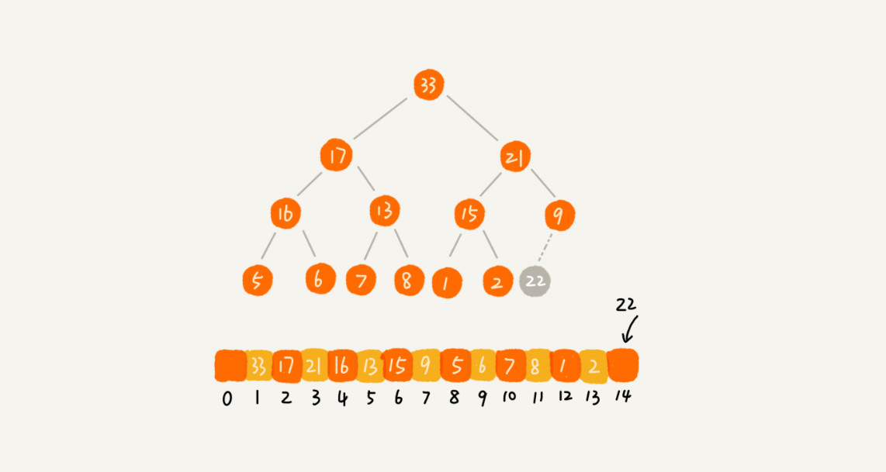
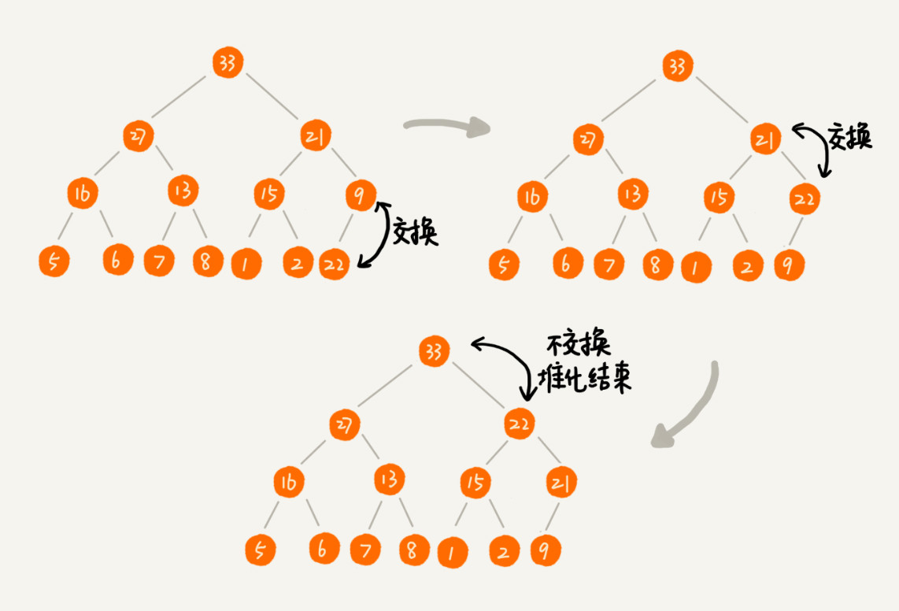
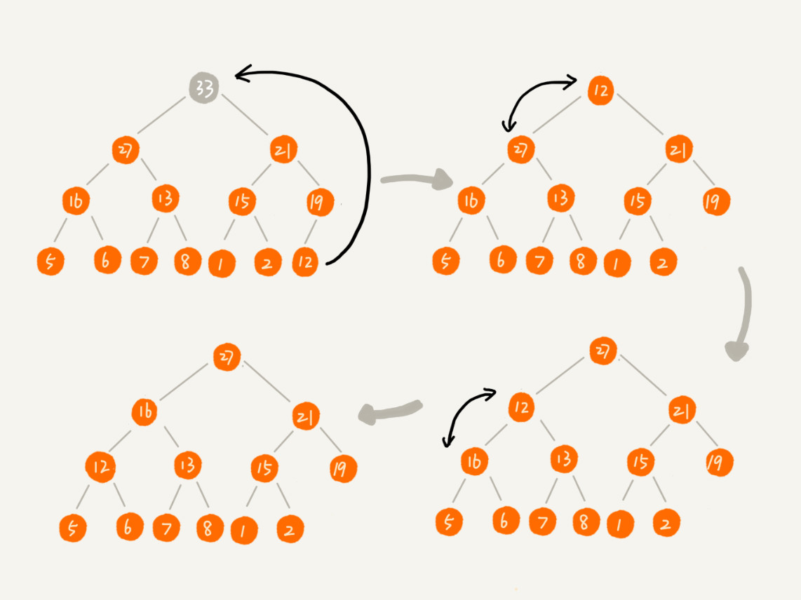

从逻辑结构上看，堆是一种非常特别的树形结构，从应用场景上看，与常见的树形结构又完全不同，使用堆还能解决许多独特的问题。

<!--more-->

## 堆的概念

堆本身是一种树形结构，总是满足以下性质：

* 堆总是一棵完全二叉树
* 堆中某个结点总是不大于或不小于其父结点的的值

### 属性

堆分为两种：根结点最大的堆叫作**最大堆**或**大根堆**；根结点最小的堆叫作**最小堆**或**小根堆**。

堆属性非常有用，其使得堆常常被当做优先队列使用，因为可以快速地访问到“最重要”的元素。

### 堆和二叉搜索树的区别

堆并不能取代二叉搜索树，它们之间有相似之处也有一些不同。

对于堆来说，在最小堆中父结点必须比子结点小，在最大堆中父结点必须比子结点大，变化是从上到下；对于二叉搜索树，左子结点比父结点小，父结点比右子结点小，变化是从左到右。

在内存占用方面，堆使用数组作为底层存储结构，占用内存空间较小；二叉搜索树使用链表作为底层存储结构，占用内存空间较大。

从平衡的角度上看，堆不需要整棵树有序，而二叉搜索树必须是平衡的，总体上是有序的。

对于搜索的效率而言，堆的搜索效率比二叉搜索树低得多，基本上可以认为堆不适合作为搜索的数据结构。

## 堆的实现

### 存储

实现一个堆，首先是涉及到如何存储一个堆。

根据堆总是一棵完全二叉树的性质，以及完全二叉树比较适合用数组来存储的概念，可以知道用数组存储堆是比较好的选择。

从上图可以看到，数组中下标为 i 的结点的左子结点，就是下标为 2i 的结点，右子结点就是下标为 2i + 1 的结点，其父结点就是下标为 i/2 的结点。

### 堆化

往堆中插入或者删除一个元素后，重要的是要继续满足堆的两个特性，而这个重新满足堆特性的过程称为**堆化**。

堆化实际上有两种：从下往上、从上往下。

### 插入元素

插入元素时涉及的是从下往上的堆化方法。

往堆中插入一个元素其实就是往底层数组的末尾添加元素，下面是示例图：

从下往上堆化的过程比较简单，实际上就是将插入的元素与父结点进行比较，出现不符合特性的情况就互换两个结点，一直重复这个过程，直至父子结点之间满足堆的特性。

### 删除元素

当删除堆顶元素的时候，为保持堆的特性，则会涉及到从上往下的堆化方法。

从上往下堆化不是直接从堆顶元素开始与子结点进行互换，而是先将数组中的最后一个元素移到被删除结点位置（为了满足完全二叉树的特性），然后利用同样的父子结点比对方法。

通常，对于大根堆会比较较大的子结点，对于小根堆会比较较小的子结点，出现不符合特性的情况就互换两个结点，一直重复这个过程，直至父子结点之间满足堆的特性。

这种方法堆化之后的结果，肯定满足完全二叉树的特性。

### 复杂度

一个包含 n 个节点的完全二叉树，树的高度不会超过 $\log_2 n$。

堆化的过程是顺着节点所在路径比较交换的，所以堆化的时间复杂度跟树的高度成正比，也就是 $O(\log_2 n)$。

插入元素和删除元素的主要逻辑就是堆化，所以往堆中插入一个元素和删除一个元素的时间复杂度都是 $O(\log_2 n)$。

