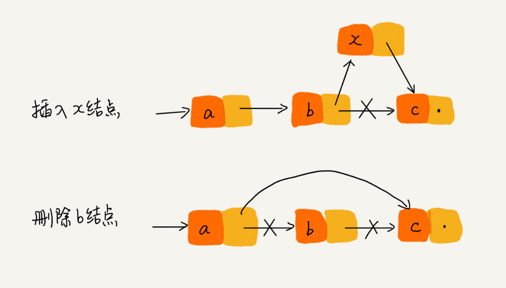
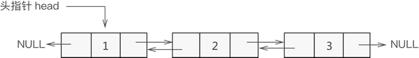

链表是两大物理存储结构之一，与数组使用一组连续的内存空间不同，链表通过链接的方式将零散的内存空间串联起来使用，是线性表的另一种存储方式。

<!--more-->

## 认识链表

链表和数组一样，也是一个线性表结构，但有一点与数组不同，链表不使用连续的内存空间进行存储，而是通过串联的方式连接元素。

因此，链表克服了数组需要预先知道数据大小的缺点，并且能充分利用计算机内存空间，实现灵活的内存动态管理。

但链表也失去了高效存取的优点，同时，由于增加了结点的指针域，空间开销相较于数组会更大。

### 链表的概念

链表通过指针将零散的内存块串联在一起，这里的内存块被称为链表的**结点**。

结点除了存储数据之外，还会存储下一个结点的地址，这个记录下一个结点地址的指针被称为**后继指针**。在双向链表中，结点还会存储上一个结点的地址，这个记录上一个结点地址的指针被称为**前驱指针**。

链表中存在两个比较特殊的结点，分别是第一个结点和最后一个结点。因此也给这两个结点取了名称，第一个结点被称为**头结点**，最后一个结点被称为**尾结点**。

### 低效存取

将链表和数组作比较，数组具有高效存取的优点，而链表是是存取效率非常低的数据结构。

这里的存取指的是通过下标的方式去访问数据，链表无法像数组一样使用寻址公式，只能通过头结点作为入口，根据指针一个结点一个结点地依次遍历，直到找到对应的结点。

综合计算下来，链表做随机访问的时间复杂度为 $O(n)$，效率比数组低得多。

### 高效增删

虽然链表在随机存取方面没有数组高效，但在插入、删除结点的时候，效率比数组高很多。

假设，要在链表中插入一个结点，在知道插入位置的前后两个相邻结点的前提下，只需将新结点的后继指针指向下一个结点，然后将上一个结点的后继指针指向这个新结点，即可完成插入结点的操作。删除结点也是类似的操作，非常方便。

但是，链表插入、删除结点的高效率依靠于知道操作位置的相邻结点，否则仍需要从头结点开始寻找到对应位置，这样的效率会非常低。

## 五花八门的链表

链表有很多不同的类型，在上面说的都是最简单的单向链表，复杂一点的还有双向链表、循环链表等等。

### 单向链表

单向链表是最简单的链表结构，它包含两个域，一个信息域和一个指针域。

信息域存储实际的数据，指针域存储下一个结点位置。

在实际编码中，为了方便，会使用哨兵结点占据头结点的位置，其信息域是空的，指针域存储实际的头结点所在位置，尾结点的指针域一般会是 `NULL` 地址。

### 双向链表

双向链表在单向链表的基础上多增加了一个指针域，这个新增加的指针域会存储上一个结点所在位置。

也就是说，在双向链表中，除头结点外，任意结点都可以访问到上一个结点，因此称为双向链表。

### 双端链表

双端链表与双向链表是完全不同的两个概念。

双端链表是在单向链表的基础上，增加了尾结点的引用。拥有这个引用的双端链表在尾部插入结点时特别方便，因此常被用作实现链式队列。

虽然双端链表可以很方便地在尾部插入结点，但由于无法快捷地获取倒数第二个结点，因此仍然不能方便地删除尾结点，若需要此功能可以靠双向链表实现。

### 循环链表

循环链表是一个头结点和尾结点连接在一起的特殊链表，通过单向链表或双向链表都能够实现。

循环链表的优点就是从链表的尾结点到头结点非常方便，也方便处理具有环形结构特点的数据，如约瑟夫问题。

### 块状链表

快状链表本身是一个链表，但是链式存储的并不是一般的数据，而是由一些数据组成的顺序表结点，这些结点也被称作块。

块状链表通过使用可变的顺序表的长度和特殊的插入、删除的方式，可以达到 $O(\sqrt{N})$ 的时间复杂度。

块状链表的另一个特点是相对普通链表来说更节省内存，因为不用保存指向每一个数据结点的指针。

## 常见问题

### 数组和链表

仅特性和效率而言，数组拥有高效随机存取的特性，链表在插入、删除结点时效率更高。因此，经常利用下标访问元素可以使用数组，经常插入、删除元素可以使用链表。

但是，不能仅仅只用复杂度分析决定使用哪种数据结构。数组简单易用，而且能够借助 CPU 缓存机制预读数组中的数据；而链表在内存中不是连续存储的，对 CPU 缓存不友好，没办法有效预读。

数组的缺点是数据大小固定，而且一经声明要占用整块连续内存空间，如果声明的数组过大，系统可能没有足够的连续内存空间分配给它。即使是在 Java 中使用可以动态扩容的 ArrayList 类型，也存在扩容耗时的问题。而链表本身没有这样的限制，天生支持动态扩容。

### 实现技巧

编写一个正确的链表是比较难的，但是其中也有以下技巧可以参考：

* 理解指针或引用的含义。将某个变量赋值给指针，实际上就是将这个变量的地址赋值给指针，或者反过来说，指针中存储了这个变量的内存地址，这个内存地址存储这个变量，通过指针能找到这个变量
* 警惕指针丢失。插入结点时，先将插入结点的后继指针指向下一个结点，再把前一个结点的指针指向插入结点，这样才不会丢失指针
* 避免内存泄漏。删除结点时，要记得手动释放内存空间
* 利用哨兵简化实现难度。在实际开发当中，如果向空链表中插入第一个结点的时候，还需要判断链表中是否已经存在头结点，嵌入代码比较严重；但是，如果增加一个哨兵结点，哨兵结点的后继指针指向头结点，则可以省略这一步操作
* 重点留意边界条件处理。当链表为空的时候，代码是否能正常工作？当链表只有一个结点的时候，代码是否能正常工作等等
* 举例画图，辅助思考。链表的指针指向会比较复杂，这种情况可以通过举例画图的办法将各种情况列举出来，这样思路会更加清晰
* 多写多练，熟能生巧。写链表代码是非常考验逻辑思维能力的，多多尝试练习可以提高逻辑思维能力

