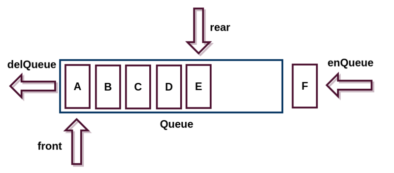
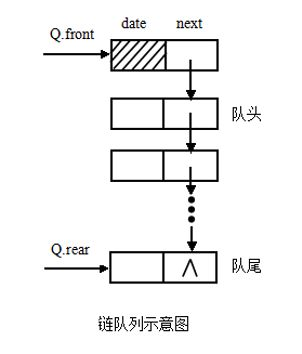
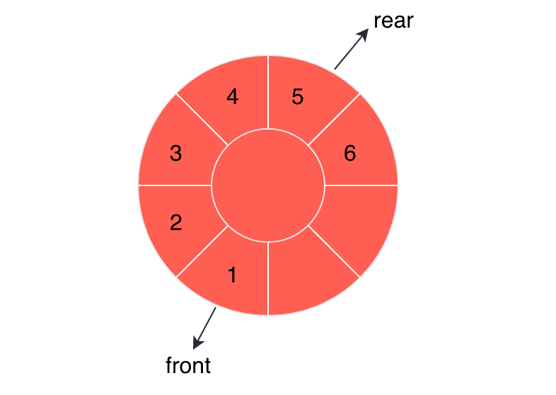
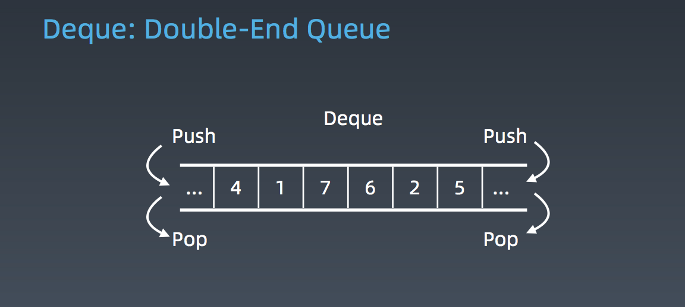

# 队列的简单认识

队列这个概念非常容易理解，将队列比喻成只能同时通过一辆汽车的隧道，当汽车进入到隧道内部，只能先进隧道的汽车先出隧道，后进隧道的汽车后出隧道。

<!--more-->

## 基本概念

队列也是一种受限的线性表，特殊之处在于它只允许在一端插入，在另一端删除。因此，先进入队列的元素能最先从队列中删除，故队列又被称为 **先进先出表**。

队列与栈非常相似，支持的操作也很有限。以下是队列的一些概念：

- 进行插入操作的端称为 **队尾**
- 进行删除操作的端称为 **队头**
- 队列中没有元素时，称为 **空队列**
- 向队列中插入一个元素称为 **入队**
- 删除队列中的一个元素称为 **出队**

## 实现类型

在物理存储层面，队列既可以用数组实现，也可以用链表实现，在这两种数据结构的基础上增加队列的限制即可。

使用数组实现的队列被称为顺序队列，使用链表实现的队列被称为链式队列。

### 顺序队列

使用数组实现的顺序队列比实现完整功能的数组更加简单，不需要实现往数组中插入元素和删除数组内元素的功能。

首先，需要申请一个大小为 n 的数组；然后，创建一个队头标识和队尾标识；当入队时，需要将队尾标识后移一位；当出队时，也需要将队头标识后移一位。

当数组无限大的时候，上述的实现方式没有任何问题。但数组向来是限制大小的，而且出队之后，数组的前半部分已经没有数据存储了，非常浪费空间。

对于这种情况，通常采用 **搬移数据** 的办法，当队尾标识已经达到 n 的下标时，则做一次数据搬移，并且将队头标识和队尾标识指向新的下标。

以这种实现思路，入队的均摊时间复杂度为 $O(1)$，出队的时间复杂度一直都是 $O(1)$。

### 链式队列

使用链表实现的链式队列比使用数组实现的顺序队列更加简单，由于链表的特性，减少了搬移数据这一步。

链表不需要提前申请内存空间，也不需要担心内存空间不够的问题，只需要创建好队头标识和队尾标识即可，因此链式队列也是常见的队列实现方式。

如果是采用尾插法实现的链表，可以将链表的哨兵结点的指向作为队头标识，这样只需要新增一个队尾标识即可。当新的元素入队时，将这个元素链接到尾结点，然后修改队尾标识的指向；需要出队时，则做删除头结点的操作，修改哨兵结点的指向。

以链表实现的队列，无论是入队还是出队，时间复杂度都可以达到 $O(1)$。

### 循环队列

顺序队列在入队时会有搬移数据的情况，存在一定的性能损耗，循环队列则是在这一方面做了部分优化，减少这一步操作。

如果把数组看作一条直线，就可以把循环队列看作一个环，通过将队列做成环的方式，可以避免数据搬移的操作。

如上图所示，通常会有一个 `front` 指针指向队头所在地址，有一个 `rear` 指针指向队尾的下一个地址，其原因主要是：若 `front` 和 `rear` 分别指向队头和队尾，无法判别队空和存在一个元素的状态。

若采用 `rear` 指针指向队尾的下一个地址的方式，则可以使用 `front` 和 `rear` 指向同一个地址来判别队空；同时，由于循环队列是逻辑上循环，通常使用求余运算判断队满，并且为了避免队空出现的 `rear % n = front` 和队满出现的 `(rear + n) % n = front` 造成差错，因此总是留出一个空位，使用 `(rear + 1) % n = front` 判断队满。

### 双端队列

双端队列是一种具有队列和栈的性质的数据结构，即常说的 deque(double-ended queue)，是一种限定插入和删除操作在表的两端进行的线性表。

现实生活中双端队列的例子：假如在电影院买票，一个刚刚买完票的人想咨询一下简单信息，就可以直接回到队伍的头部，如果在队尾排队的人不想看电影了，就可以从队尾直接离开队伍。

尽管双端队列看起来似乎比栈和队列更灵活，但实际上在应用程序中远不及栈和队列普遍。

## 应用场景

队列的应用场景非常广泛，尤其是一些带有特殊性质的队列，在各自的应用场景如鱼得水。

### 阻塞队列

阻塞队列在队列的基础上增加了阻塞的特性。

当队列为空的时候，出队的操作会被阻塞，直到队列中有数据；当队列满了的时候，入队的操作也会被阻塞，直到队列中有空闲位置可以插入数据。

常见的场景就是“生产者 - 消费者”模型，使用阻塞队列可以有效地协调生产和消费的速度。

### 并发队列

并发队列指的是在多线程情景下，多个线程同时操作队列，而这个队列如果是线程安全的，则被称为并发队列。

实现并发队列最简单的方式就是在入队、出队的时候加锁，但是这会影响队列的并发量，队列在同一时刻仅能处理一个存取操作。

实际上，使用循环队列和 CAS 原子操作，就可以实现非常高效的无锁并发队列。

### 优先队列

优先队列是在队列的概念上，对元素赋予优先级，访问时是具有最高优先级的元素先出队。

通常优先队列会使用堆来实现，如大根堆就很好的表示了根结点是优先级最高的元素。当出队时可以先删除根结点，然后从上往下堆化；入队时则需要从下往上堆化。

可以看出，优先队列其实是堆的一种使用方式，赋予了队列的名称，保持和普通队列相同的操作方法。

