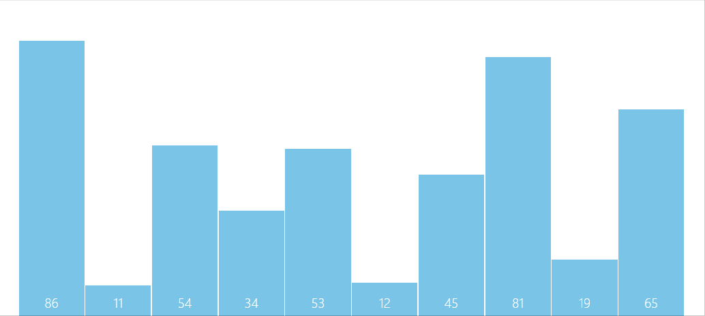

插入排序在对基本有序的较小序列进行排序时，效率是非常高的，希尔排序针对这一点对插入排序的方式进行了再次优化。

<!--more-->

## 详细描述

希尔排序又称为缩小增量排序，主要是对序列按下标的一定增量进行分组，对每组使用直接插入排序算法排序；随着增量逐渐减小，每组包含的关键字越来越多，当增量减至 1 时，整个文件恰被分成一组，算法便终止。

希尔排序详细的执行步骤如下：

1. 选择一个增量序列 t1, t2, ..., tk，其中 ti > tj，tk = 1；
2. 按增量序列个数 k 对序列进行 k 趟排序；
3. 每趟排序，根据对应的增量 ti 将待排序序列分割成若干长度为 m 的子序列，分别对各子表进行直接插入排序；
4. 仅增量因子为 1 时，整个序列作为一个表来处理，表长度即为整个序列的长度。

## 算法图解



## 问题解疑

### 希尔排序是原地排序算法吗?

希尔排序是插入排序的一个优化版本，利用优化的策略使用插入排序，提高效率，没有使用到额外的内存空间，因此希尔排序是原地排序算法。

### 希尔排序是稳定的排序算法吗？

插入排序是稳定的排序算法，但是，由于希尔排序使用了增量间隔进行插入排序，希尔排序并不能像插入排序保持稳定，排序过程中会出现相等的两数前后顺序不一致。

### 希尔排序的时间复杂度是多少？

最好情况时间复杂度为 $O(n)$；最坏情况时间复杂度为 $O(n^2)$；由于希尔排序花费的时间还由增量间隔决定，平均时间复杂度并不能明确得出，平均时间复杂度可看作为 $O(n^{1.3 \sim 2})$。

## 代码实现

### 排序接口

```java
package cn.fatedeity.algorithm.sort;

/**
 * 排序接口
 */
public interface Sort {
    int[] sort(int[] numbers);
}
```

### 排序抽象类

```java
package cn.fatedeity.algorithm.sort;

/**
 * 排序抽象类
 */
public abstract class AbstractSort implements Sort {
    protected void swap(int[] numbers, int src, int target) {
        int temp = numbers[src];
        numbers[src] = numbers[target];
        numbers[target] = temp;
    }
}
```

### 希尔排序类

```java
package cn.fatedeity.algorithm.sort;

/**
 * 希尔排序类
 */
public class ShellSort extends AbstractSort {
    @Override
    public int[] sort(int[] numbers) {
        if (numbers.length <= 1) {
            return numbers;
        }

        int length = numbers.length;
        // 通常增量序列进行二分对原序列拆分
        for (int gap = length >> 1; gap > 0; gap = gap >> 1) {
            for (int i = gap; i < length; i++) {
                int j = i, current = numbers[i];
                while (j >= gap && numbers[j - gap] > current) {
                    numbers[j] = numbers[j - gap];
                    j = j - gap;
                }
                numbers[j] = current;
            }
        }
        return numbers;
    }
}
```

