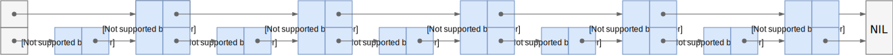
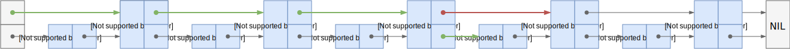
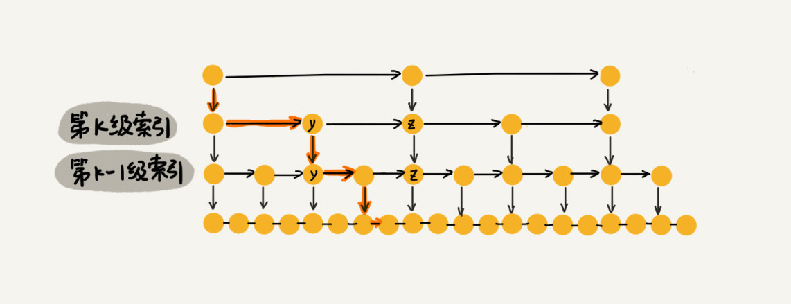
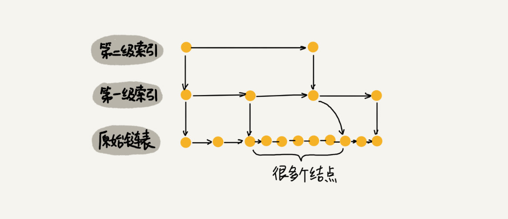

有序的数组可以使用二分查找的方法快速检索一个数据，但是同为线性表结构的链表没有办法使用二分查找，而跳表突破了这个限制，允许链表使用类似于二分查找的方法查找数据。

<!--more-->

## 图解分析

对于一个单向链表来说，即使链表中存储的是有序的数据，但如果想要从中查找某个数据时，也只能从头到尾遍历链表，其时间复杂度是 $O(n)$。

为了提高链表的查询效率，使其支持类似“二分查找”的方法，对链表进行多层次扩展，这样的数据结构就是**跳表**。跳表对标的是平衡树，是一种提升链表插入、删除、搜索效率的数据结构。

首先，跳表处理的是**有序**的链表，一般使用双向链表更加方便。


然后，每两个结点提取一个结点到上一级，提取的这一层被称作为**索引层**。



这时候，当想要查找 19 这个数字，可以先从索引层开始查找；当到达 17 时，发现下一个结点存储 21 这个数字，则可以确定，想要查找的 19 肯定是在 17 到 21 之间；这时候可以转到下一层（原始链表）中查找，快速从 17 开始检索，很快就可以查找出 19 这个数字。



加入一层索引之后，查找一个结点需要遍历的结点个数减少了，也就是查找效率提高了。实际上，一般会新增多层索引，拥有多层索引的跳表，查找一个结点需要遍历的结点个数将再次减少。


这种链表加多层索引的结构，就是跳表。

## 效率分析

为了方便对跳表的效率做分析，在这里设定一个常见的跳表类型。

假设每两个结点会抽出一个结点作为上一级索引的结点，那第一级的索引个数大约就是 $\frac{n}{2}$，第二级的索引个数大约就是 $\frac{n}{4}$，以此类推，第 k 个索引的结点个数是第 k-1 个索引的结点个数的 $\frac{1}{2}$，那么，第 k 个索引的结点个数就是 $\frac{n}{2^k}$。

### 时间复杂度

假设索引总共有 h 级，最高级的索引有 2 个结点，使用公式 $\frac{n}{2^h} = 2$ 进行反推，可以计算得出 $h = \log_2 n - 1$，如果包含原始链表那一级，跳表的高度就是 $\log_2 n$ 级。

当想要从跳表中查询某个数据时，每层都会遍历 m 个结点，那么，在跳表中查询一个数据的时间复杂度就是 $O(m \log n)$。



从上面图中可知，在每一级索引中最多只需要遍历 3 个结点，其实就可以看作是 m = 3。

实际就是，在最高级索引时最多遍历 3 个结点，当需要在下一级索引中继续检索时，算上前后两个当做范围的结点也只有 3 个，因此，在每一级索引最多只需要遍历 3 个结点。

如果细究的话，m 的值与抽取索引值的间隔有直接关系，但是只是计算时间复杂度的话，可以将 m 值看作是一个常数。

因此，在跳表中做检索的时间复杂度是 $O(\log n)$。

### 空间复杂度

同样的，假设每两个结点会抽出一个结点作为上一级索引的结点，那第一级的索引个数大约就是 $\frac{n}{2}$，第二级的索引个数大约就是 $\frac{n}{4}$，依次类推，最终索引占用的空间将是 $\frac{n}{2} + \frac{n}{4} + ... + 4 + 2 = n - 2$。

所以，跳表的空间复杂度是 $O(n)$。

实际上，跳表是一种使用空间换时间的数据结构，以增加索引的方式，提高检索数据的效率。因此，跳表会比普通链表耗费更多内存进行数据存储。

### 结点间隔

在上述分析跳表的时间复杂度和空间复杂度时，都是以每两个结点抽出一个结点作为上一级索引的结点。

实际上，也可以使用 3 个结点或 4 个结点甚至更多结点做间隔。当然，以不同个数结点做间隔时，检索效率和内存占用都会有些不一样。

假设以 3 个结点做间隔，占用的空间会有所降低，在这个跳表上做检索操作时，检索的效率也会有一些降低。

因为在每一级索引检索的最多结点个数将从 2 个变成 3 个，跳表的高度是 $\log_3 n$ 级，最终占用的空间将是 $\frac{n}{3} + \frac{n}{9} + ... + 3 + 1 = \frac{n}{2}$。

在理论上，以 3 个结点做间隔的跳表与以 2 个结点做间隔的跳表的时间复杂度和空间复杂度都是一样的。但是，实际操作时，以 3 个结点做间隔的跳表的空间占用会比以 2 个结点做间隔的跳表更优一些。

实际上，在软件开发中，不必太在意索引占用的额外空间。虽然原始链表中存储的有可能是很大的对象，但索引结点可以只存储关键值和几个指针，并不需要存储对象，所以当对象比索引结点大很多时，那索引占用的额外空间就可以忽略了。

## 动态插入和删除

上面理解的跳表都是静态的，实际开发中，跳表在新增、删除结点时需要做动态处理，否则容易导致检索效率降低。



如上图所示，如果频繁插入结点，而没有对索引层做动态处理，很容易出现不满足一开始设定的跳表规则。

删除链表的结点时也是同样道理，如果删除结点而没有更新索引层，索引层容易出现已被删除的脏结点。

### 重建索引

比较容易理解的方法就是重建索引，当每次插入、删除结点的时候，把整个跳表的所有索引层删除重建。

但是这种方法会降低插入结点时的效率，已知跳表的空间复杂度是 $O(n)$，也可以推断出重建跳表索引层的时间复杂至少是 $O(n)$。

也就是说，使用重建索引的方式，跳表插入结点耗费时间将会直线上升。

### 随机索引

与重建索引相比，随机索引的效率会更高一些，像 Redis 实现 SortedSet 底层用的跳表就是使用随机索引的方式进行动态处理。

这里的做法是通过使用一个随机函数，来决定这个结点插入时，是否需要插入到索引层、以及插入到第几级索引。

一般来说，通过随机函数得到的数据都是比较均匀的，也表示最终得到的跳表索引层也是比较均匀，而且数据量越大，索引层越是均匀。

先设定索引的生成规则：从原始链表中随机选择 $\frac{1}{2}$ 个结点作为一级索引，从一级索引中随机选择  $\frac{1}{4}$ 个结点作为二级索引，以此类推，一直到最顶层索引。这时候就需要根据这个规则完成所需的随机函数，并且是每次插入结点的时候，都通过随机函数判断这个结点需要插入到几级索引。

以下是 Redis 源码当中使用到的[随机函数](https://github.com/redis/redis/blob/unstable/src/t_zset.c)：

```c
/* Returns a random level for the new skiplist node we are going to create.
 * The return value of this function is between 1 and ZSKIPLIST_MAXLEVEL
 * (both inclusive), with a powerlaw-alike distribution where higher
 * levels are less likely to be returned. */
int zslRandomLevel(void) {
    int level = 1;
    while ((random()&0xFFFF) < (ZSKIPLIST_P * 0xFFFF))
        level += 1;
    return (level<ZSKIPLIST_MAXLEVEL) ? level : ZSKIPLIST_MAXLEVEL;
}
```

这个随机函数会随机生成 1 到索引最高层数之间的一个数字，该方法有 $\frac{1}{2}$ 的概率返回 1、有 $\frac{1}{4}$ 的概率返回 2、有 $\frac{1}{8}$ 的概率返回 3、以此类推。其中 1 表示不需要生成索引，2 表示需要生成一级索引，3 表示需要生成二级索引，以此类推。

为什么不是返回 1 时生成一级索引呢？这是因为，在生成比一级索引更高层级的索引时，都会向下生成索引，即如果随机函数返回 3，则会给这个结点同时生成二级索引和一级索引。这样，如果返回 1 时生成一级索引则会出现生成一级索引的概率为 100%。

使用随机索引方法的跳表，插入结点的时间复杂度与跳表索引的高度相同，最终时间复杂度降到 $O(\log n)$，而不是重建索引的 $O(n)$。

## 应用场景

### 跳表和平衡查找树

与平衡查找树相比，跳表拥有以下优势：

* 跳表的底层原始链表支持范围查询
* 跳表相对简单，更容易使用代码实现
* 跳表更加灵活，可以通过改变索引构建策略，有效平衡执行效率和内存消耗

针对上述的第 1 点，支持范围查询的 B+ 树更适用于磁盘，跳表主要用于内存中读取数据。

### LSM-Tree

LSM-Tree 全称是 Log Structured-Merge Tree，其中文名是日志结构的合并树，是一种分层的、有序的、基于硬盘的数据结构。

LSM-Tree 的核心思路是，首先写入数据到内存中，不需要每次有数据更新时就必须将数据写入到磁盘中，内存达到阈值之后，再使用归并排序的方式将内存中的数据合并追加到磁盘队尾。

因为跳表恰好就是天然有序的，所以在 flush 的时候效率很高，通常基于 LSM-Tree 结构的数据库在内存部分都会选择跳表这种数据结构。

HBase 的 MemStore 内部基于 LSM-Tree 实现，Google 开源的 LevelDB 以及 Facebook 基于 LevelDB 优化的 RocksDB 内部的 MemTable 都是基于 LSM-Tree 实现，它们都使用到了跳表这一结构。

