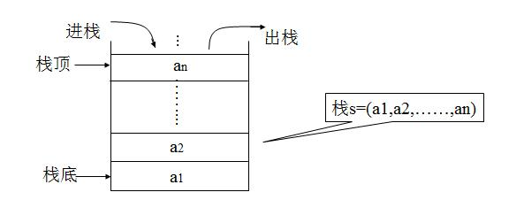
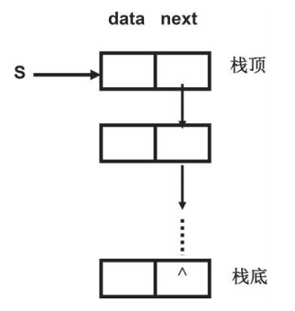
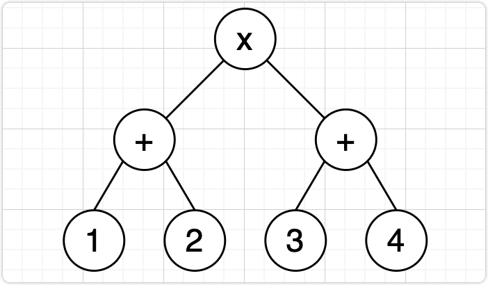

数据结构中的栈是一种操作受限的线性表，只允许在一端插入和删除数据，但却是计算机科学领域中非常重要的数据结构，常使用在底层结构。

<!--more-->

## 栈的概念

从功能上来说，同为线性表的数组和链表完全可以替代栈的使用。

但是，从某种角度来说，数组和链表暴露太多的操作接口，使用起来比较复杂，非常容易出错。

因此，当数据集合只需要在一端插入和删除数据，并且满足先进后出、后进先出的特性，可以首选“栈”这种数据结构。

以下是栈的一些概念：

- 允许进行插入和删除操作的一端称为 **栈顶**，栈顶会根据插入、删除操作进行浮动
- 不允许进行插入和删除操作的一端称为 **栈底**，栈底是固定不变的
- 栈中元素个数为零时称为 **空栈**
- 往栈中插入元素称作 **进栈**
- 删除栈顶的元素称作 **出栈**

## 栈的实现

在物理存储层面，栈既可以用数组实现，也可以用链表实现，在这两种数据结构的基础上增加栈的限制即可。

使用数组实现的栈被称为顺序栈，使用链表实现的栈被称为链式栈。

### 顺序栈

使用数组作为栈存储数据的物理存储结构，需要先申请一个大小为 n 的数组。

将数组的尾部作为栈顶，入栈和出栈都只在栈顶做相应处理，使用一个变量表示数组存储的元素个数，这样入栈、出栈的操作都能达到 $O(1)$ 的时间复杂度。

基于数组实现的栈存在一个限制，即数组在声明之后是固定大小的，当栈满的时候，则无法再次往数组中添加数据。这样就涉及到对数组进行动态扩容，当数组空间不够的时候，需要重新申请一块更大的内存，将原来数组中数据统统拷贝过去。

实际上，支持动态扩容的顺序栈在实际开发中并不常见。使用到顺序栈这种数据结构的情况，一般都是规模比较小的数据，知道数据的最大规模时可以避免爆栈。

### 链式栈

对于数据规模比较大的情况，使用链表实现栈则会更加方便。这时候，不需要提前申请内存空间，而是需要创建一个哨兵结点指向头结点。

链式栈一般会使用头插法创建链表。将头结点作为栈顶，每次入栈都当作链表在头结点插入元素，每次出栈都当作链表删除头结点。这些操作都只需要处理好哨兵结点的指向即可，使用链式栈能达到 $O(1)$ 的时间复杂度。

基于链表实现的栈不需要像数组一样要动态扩容，链表是天生支持动态扩容的。

## 应用场景

### 函数调用栈

函数调用栈是一个非常经典的应用场景。

操作系统会给每个线程分配一块独立的内存空间，这块内存被组织成“栈”这种数据结构，用来存储函数调用时的临时变量。

每进入一个函数，就会将临时变量作为一个栈帧入栈，当被调用函数执行完成，返回到上层函数之后，再将这个函数对应的栈帧出栈。

直到函数栈为空，则表示最外层的函数已经执行完毕。

### 逆波兰表达式

编译器还会利用栈来实现表达式求值，这部分也有非常成熟的四则运算算法——逆波兰表达式。

通常的四则运算表达式写成 `(1 + 2) x (3 + 4)`，加减乘除等运算符写在中间，因此也被称作“中缀表达式”；逆波兰表达式的写法是 `1 2 + 3 4 + x`，运算符被写在后面，因而也被称作“后缀表达式”；除此之外，还有波兰表达式，其写法是 `x + 1 2 + 3 4`，被称作“前缀表达式”。

如果将表达式画出一棵语法树，就能以树的概念来直观理解前缀、中缀、后缀的含义，前缀表达式对应树的前序遍历，中缀表达式对应树的中序遍历，后缀表达式对应树的后序遍历，如下图所示：

如果要使用逆波兰表达式来做四则运算，需要先将中缀表达式转换成逆波兰表达式，涉及到操作数栈和运算符栈：

1. 从左向右遍历中缀表达式；
2. 若读取的是操作数，将操作数存入到操作数栈中；
3. 若读取的是运算符，还需要根据运算符类型进一步判断：
    1. 如果是 `(` 运算符，则直接存入运算符栈中；
    2. 如果是 `)` 运算符，则输出运算符栈中的运算符到操作数栈，直到遇到 `(` 运算符，在这里放弃 `(` 和 `)` 运算符；
    3. 如果是非括号运算符，还需要与运算符栈栈顶的运算符比较优先级：
        1. 如果运算符栈栈顶的运算符是括号，则将当前运算符直接存入运算符栈中；
        2. 如果当前运算符比运算符栈栈顶的运算符优先级更高时，则直接存入运算符栈中；
        3. 如果当前运算符比运算符栈栈顶的运算符优先级更低或相等时，则输出栈顶运算符到操作数栈，然后将当前运算符压入操作符栈；
4. 当表达式读取完后，将运算符栈中的运算符依次出栈到操作数栈中，直到运算符栈为空。

经过上述步骤后，则可以将中缀表达式转换成逆波兰表达式，随后对逆波兰表达式做运算得到表达式的结果：

1. 从左向右遍历逆波兰表达式；
2. 若读取的是操作数，将操作数存入栈中；
3. 若读取的是运算符，则对栈顶的两个操作数执行该运算，然后将运算结果存入栈中；
4. 重复上述的步骤 1~3，最终栈中的元素即为结果值。

