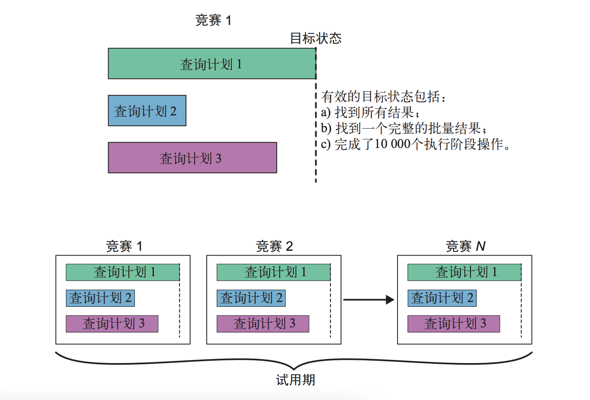
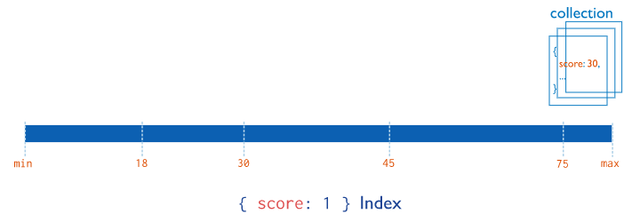
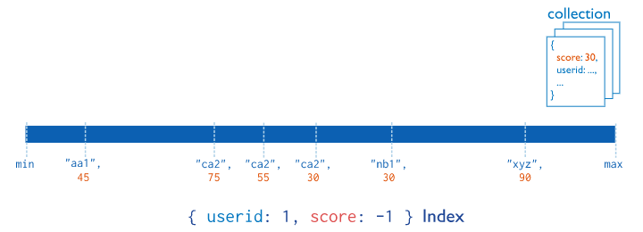
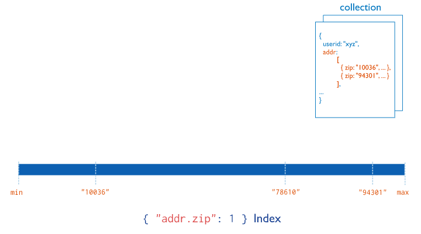
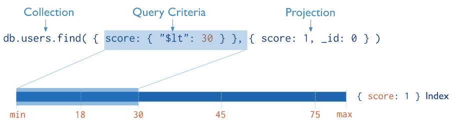

# MongoDB - 索引知识


学会 MongoDB 的增删改查只能算得上是“初窥门径”，了解、熟练掌握索引才能算得上“融会贯通”。基本可以认为数据库的索引知识是一个初级开发向中级开发转变所必备的知识。

<!--more-->

## 索引简介

### 什么是索引

索引最常用的比喻就是书籍的目录，查询索引就像查询一本书的目录。

索引支持 MongoDB 查询的高效执行。如果没有索引，MongoDB 必须扫描集合中每一个文档，以选择与查询语句相匹配的文档。如果查询存在适当的索引，MongoDB 就可以使用索引来限制它扫描的文档数。

筛选字段时使用索引提速有以下几个因素：

- 索引数据通过 B 树来存储，从而使得搜索的时间复杂度为 $O(\log n)$
- 索引本身存储在高速缓存中，相比磁盘 IO 有大幅的性能提升（有的时候数据量非常大的时候，索引数据也会非常大，当大到超出内存容量的时候，会导致部分索引数据存储在磁盘上，这会导致磁盘 IO 的开销大幅增加，从而影响性能，所以务必要保证有足够的内存能容下所有的索引数据）

索引可以显著缩短查询时间，但是使用索引、维护索引是有代价的。在执行写入操作时，除了要更新文档之外，还必须更新索引，这必然会影响写入的性能。

因此，当有大量写操作而读操作少时，或者不考虑读操作的性能时，都不推荐建立索引。

### 何时不使用索引

查询结果集在原集合中占比越大，索引就会越低效。

出现这种情况的原因是：使用索引需要进行两次查找：一次是查找索引项，一次是根据索引的指针去查找其指向的文档。而全表扫描只需进行一次查找：查找文档。在最坏的情况下（返回集合内的所有文档），使用索引进行查找的次数会是全表扫描的两倍，通常会明显比全表扫描慢。

根据经验，如果查询返回集合中 30% 或更少的文档，则索引通常可以加快速度。然而，这个数字会在 2%～60% 变动。

通常，索引使用的情况有这些：比较大的集合、比较大的文档、选择性查询。

而全表扫描相对使用的情况有这些：比较小的集合、比较小的文档、非选择性查询。

总结一下就是，在以下情况不推荐使用索引：

- 有大量写操作而读操作较少的场景，更新损耗比查询的损耗更大，不推荐建索引
- 查询结果集在原集合中占比越大，索引就会越低效
- 索引基数（字段去重后的数量）越低，索引的作用就越小

### MongoDB 如何选择索引

MongoDB 如何选择索引具有自己的机制，通常是根据要搜索的字段和一些附加信息（比如是否有排序）有关。基于这些信息，系统会识别出可能用于满足查询的候选索引。

当候选索引被选出之后，则会进行候选索引竞赛的阶段。

在竞赛阶段，MongoDB 会分别为这些候选索引创建 1 个查询计划，并在并行线程中运行这些查询计划，每个线程使用不同的索引。



到达目标状态的第一个查询计划成为赢家。更重要的是，具有相同 **形状** 的其他查询都会选择这个索引。

服务端会维护这些查询计划的缓存，以备将来用于进行相同 **形状** 的查询。

通常，以下这些事件导致缓存被清除掉：随着时间变化、重建特定的索引、添加或删除索引、显式清除计划缓存、mongod 进程的重启等。

## 索引的类型

### 单一索引



MongoDB 提供了默认的 `_id` 索引，在此之外，还支持对文档的单个字段创建用户定义的升序、降序索引。但是对于单字段索引，索引键的排序顺序并不重要，因为 MongoDB 可以在任意方向上遍历索引。

### 复合索引



MongoDB 还支持在多个字段上定义索引，即复合索引。

在考虑复合索引的设计时，需要知道对于利用索引的通用查询模式，如何处理其等值过滤、多值过滤以及排序这些部分。大部分情况可以参考以下准则：

- 等值过滤字段应该在最前面
- 排序字段应在多值过滤字段之前
- 多值过滤字段应该在最后面

### 多键索引



多键索引和复合索引的概念不能搞混，如果一个文档有被索引的数组字段，则该索引会立即被标记为多键索引。

对数组创建索引就是对数组中的每个元素创建索引，而不是对数组本身创建索引。

对数组创建索引有一个例外，即 MongoDB 最多支持对一个数组字段创建索引，索引项中不允许出现多个数组字段，这是为了避免多键索引中的索引项数量呈爆炸式地增长。

多键索引通常会比非多键索引慢一些，可能会有许多索引项指向同一个文档。而一旦索引被标记为多键多键，就再也无法变成非多键索引，唯一办法是将多键索引删除重建成非多键索引。

### 地理空间索引

为了支持对地理空间坐标数据的高效查询，MongoDB 提供了两个特殊索引：返回结果时使用平面几何的 `2d` 索引和使用球面几何的 `2dsphere` 索引。

创建索引时，通过将索引键的值设置成 `2d` 或者是 `2dsphere` 即可创建地理空间索引。

### 文本索引

MongoDB 提供了一种文本索引类型，支持在集合中搜索字符串内容。这些文本索引不存在特定于语言的停用词（如 `the`、`a`、`or` 等），并且集合中的词干仅存储词根。

文本索引需要一定数量的与被索引字段中单词成比例的键，创建文本索引可能会耗费大量的系统资源。同时写操作通常比对单一索引、符合索引，甚至多键索引的写操作开销更大，应在需求明确时创建文本索引。

创建索引时，通过将索引键的值设置成 `text` 即可创建文本索引，并且可以同时对多个键创建文本索引。在创建文本索引时，也可以用 `$**` 表示文档的所有字符串字段。

默认情况下，文本索引中的每个字段都会被平等对待。也可以通过 `wights` 属性设置本文索引中每个键的权重。但需要注意的是，文本索引一旦被创建，就不能改变索引的权重了（除非删除索引再重建）。

文本索引能解决搜索关键字的问题，但对于在中国使用汉字的应用程序来说，请谨慎使用。从 [官方文档](https://www.mongodb.com/docs/manual/reference/text-search-languages/) 中可以了解到支持到语言，其中并没有包含汉字。

### 哈希索引

为了支持基于哈希的分片，MongoDB 提供了哈希索引类型，索引字段值的哈希值。这些索引在其范围内具有更随机的值分布，但仅支持等值匹配而不支持范围查询。

对于嵌入文档，哈希索引的哈希函数会折叠其值并计算哈希值，而对于数组，哈希索引是不支持的，对其创建哈希索引时会返回错误。

MongoDB 不支持在哈希索引上指定唯一约束，可以通过对存储原始值的键构建唯一索引以指定唯一约束。

在创建索引时，通过将键的值设置为 `hashed` 即可将其设置成哈希索引。

## 索引的属性

### 唯一索引

索引的唯一属性会导致 MongoDB 拒绝索引字段的重复值。除了唯一约束之外，唯一索引在功能上可与其他 MongoDB 索引相同。

对于单一索引，唯一属性针对的是单个键值；对于复合索引，唯一属性针对的是所有键值的组合。

在某些情况下，索引桶（index bucket）的大小是有限制的，如果索引项超过了索引桶的大小就不会被包含在索引中。

在 MongoDB 4.2 之前，索引中包含的字段必须小于 1024 字节，也就是说大小超过 1024 字节的键不会受到唯一索引的约束；在 MongoDB 4.2 及以后版本，这个限制被去掉了。

创建索引时设置 `{unique: true}` 可以设置唯一索引。

### 部分索引

部分索引在 3.2 版本新增，其表示仅索引符合特定过滤表达式的文档。

MongoDB 的部分索引只会在数据的一个子集上创建，通过索引集合中的文档子集，部分索引具有较低的存储要求，可以减少索引创建和维护的性能成本。

创建索引时设置 `partialFilterExpression` 选项，可以只对符合表达式要求的值做索引。

当查询条件匹配部分索引时，不在索引内的值不在搜索结果当中，如果需要返回那些缺少字段的文档，可以使用 `hint` 强制执行全表扫描。

### 稀疏索引

稀疏索引也称为间隙索引，就是包含具有索引字段的文档的条目，跳过没有索引字段的文档。

通过上述的定义可以看出，稀疏索引是部分索引的子集，创建部分索引时设定索引键必须存在的过滤表达式即可达到稀疏索引的作用。

将稀疏索引和唯一索引组合，以拒绝具有字段重复值的文档，但忽略没有索引键的文档。

创建索引时设置 `{sparse: true}` 可以设置稀疏索引。

### TTL 索引

TTL 索引提供了一个过期机制，允许为每一个文档设置一个过期时间，当一个文档达到预设的过期时间之后就会被删除。

TTL 索引有自己适合的场景，如机器生成的事件数据，日志和会话信息等，这些信息通常只需在数据库中保存有限的时间。

MongoDB 会每分钟扫描一次 TTL 索引，因此不应依赖于秒级的粒度。

创建索引时设置 `{expireAfterSeconds: <seconds>}` 可以设置 TTL 索引，通常索引键时日期类型时，TTL 索引才会起作用。

> MongoDB 还提供了一种类似于固定长度队列的集合，称作为“固定集合”。其长度是固定的，当集合已满足设定大小时，旧的文档会被删除，新的文档将取而代之。
>
> 通常来说，相对于固定集合，MongoDB 优先推荐使用 TTL 索引，因为其在 WiredTiger 存储引擎（在 3.2 版本开始作为默认存储引擎）中性能更好，可操作性也更强。

### 不区分大小写的索引

在 3.4 版本，MongoDB 提供了不区分大小写索引属性，支持在不考虑大小写的情况下执行字符串比较的查询。

创建索引时通过设置 `{collation: {locale : <locale>, strength : <strength>}}` 可以创建不区分大小写的索引。

其中，`locale` 指定语言规则，可以通过 [官方文档](https://www.mongodb.com/docs/v4.4/reference/collation-locales-defaults/#std-label-collation-languages-locales) 查看更多，使用 `strength` 可以指定比较级别，可以通过 [官方文档](https://www.mongodb.com/docs/v4.4/reference/collation/#std-label-collation-document-fields) 了解更详细内容。

## 索引的使用

### 管理索引

索引的所有信息都存储在 `system.indexes` 集合中，这是一个保留集合，不支持修改或删除，只能通过相关命令对其进行操作。

MongoDB 提供了一些相关命令管理索引，以下是常用的方法：

- `db.collection.createIndex(keys, options, commitQuorum)`: 创建单个索引
- `db.collection.createIndexes([keyPatterns], options, commitQuorum)`: 创建多个索引
- `db.collection.dropIndex(index)`: 删除集合中除 `_id` 的指定索引
- `db.collection.dropIndexes()`: 不传参时可以删除集合中除 `_id` 的全部索引，也可以指定索引名实现删除指定索引
- `db.collection.getIndexes()`: 查询集合的索引信息
- `db.collection.hideIndex(<index>)`: 在 4.4 版本新增，隐藏索引对查询计划器不可见，不能用于查询，可以通过隐藏索引发现在不删除索引的情况下评估删除所有的潜在影响
- `db.collection.unhideIndex(<index>)`: 取消隐藏索引

MongoDB 的索引名称可标识索引，大部分的索引管理命令都支持使用名称指定索引。

索引名称的默认形式是 `keyname1dir1_keyname2_dir2..._keynameN_dirN`，其中 `keynameX` 是索引的键，`dirX` 是索引的方向（`1` 或 `-1`）。

索引名称是有字符数限制的，并且比较多的键时也会难以辨识，因此创建复杂的索引时可以自定义名称。

### 修改索引

当需要修改索引时，通常的做法是先使用 `dropIndex(index)` 删除指定索引，再使用 `createIndex` 重建索引。

修改索引的操作一般发生在应用程序已经上线之后，这时就需要考虑到创建索引既耗时又耗资源，考虑使用 `background` 选项在后台创建索引，尽可能减少对读写操作的影响。

在 MongoDB 4.2 之后，引入了混合索引创建的机制，即在索引创建的开始和结束时持有排他锁，创建过程中其余部分会交错地让步于读写操作。

### 索引方向

使用单一索引时，索引键的方向并不重要，MongoDB 会根据排序的方向，选择扫描索引的方向。只有基于多个查询条件进行排序时，索引方向才是重要的。

对于复合索引，有可能对不同的键设置不同的方向，这与实际的业务有关系。

通常是创建与排序方向相同的索引方向，且相互反转（在每个方向上都乘以 -1）的索引是等价的：`{age: 1, username: -1}` 适用的查询与 `{age: -1, username: 1}` 完全一样。

### 索引基数

索引的基数是指集合中某个字段有多少个不同的值，即值去重后的数量。

通常来说，一个字段的基数越高，这个字段上的索引就越有用。对于基数比较低的字段，索引通常无法排除大量可能的匹配项。

一个例子就是，如果对“性别”字段创建索引，而查找“男性”时仅能将搜索空间缩小大约 50%，其索引作用相对是较低的。

根据经验来说，应该在基数比较高的键上创建索引，或者至少应该把基数比较高的键放在复合索引的前面（在低基数的键之前）。

### 左前缀原则

MongoDB 的复合索引遵循左前缀原则：拥有多个键的索引，可以同时得到所有这些键的前缀组成的索引，但不包括除左前缀之外的其他子集。

比如说，有一个类似 `{a: 1, b: 1, c: 1, ..., z: 1}` 这样的索引，那么实际上也等于有了 `{a: 1}`、`{a: 1, b: 1}`、`{a: 1, b: 1, c: 1}` 等一系列索引，但是不会有 `{b: 1}` 这样的非左前缀的索引。

### 交叉索引

在 2.6 版本新增，MongoDB 可以使用交叉索引来完成查询。

对于指定复合条件的查询，如果一个索引可以满足查询条件的一部分，而另一个索引可以满足查询条件的另一部分，则 MongoDB 可以使用两个索引的交集来完成查询。

使用复合索引还是使用交叉索引更有效取决于具体的查询和系统。

### 覆盖查询



当查询子句和查询投影仅包含索引字段时，MongoDB 可以直接从索引返回结果，而无需扫描任何文档或加载文档到内存。

这样的覆盖查询非常有效，效率非常高。必要时还需要对不做查询的字段进行索引，以满足覆盖索引的要求。

如果对一个被覆盖的查询运行 `explain`，那么结果中会有一个并不处于 `FETCH` 阶段下的 `IXSCAN` 阶段，并且在 `executionStats` 中，`totalDocsExamined` 的值是 `0`。

## 查询计划

使用 `explain` 可以为查询提供大量的信息，它是慢查询的重要诊断工具之一。下述是执行结果示例：

```json
{
    "queryPlanner": {
        "plannerVersion": 1,
        "namespace": "test.users",
        "indexFilterSet": false,
        "parsedQuery": {
            "age": {
                "$eq": 42
            }
        },
        "winningPlan": {
            "stage": "FETCH",
            "inputStage": {
                "stage": "IXSCAN",
                "keyPattern": {
                    "age": 1,
                    "username": 1
                },
                "indexName": "age_1_username_1",
                "isMultiKey": false,
                "multiKeyPaths": {
                    "age": [],
                    "username": []
                },
                "isUnique": false,
                "isSparse": false,
                "isPartial": false,
                "indexVersion": 2,
                "direction": "forward",
                "indexBounds": {
                    "age": [
                        "[42.0, 42.0]"
                    ],
                    "username": [
                        "[MinKey, MaxKey]"
                    ]
                }
            }
        },
        "rejectedPlans": []
    },
    "executionStats": {
        "executionSuccess": true,
        "nReturned": 8449,
        "executionTimeMillis": 15,
        "totalKeysExamined": 8449,
        "totalDocsExamined": 8449,
        "executionStages": {
            "stage": "FETCH",
            "nReturned": 8449,
            "executionTimeMillisEstimate": 10,
            "works": 8450,
            "advanced": 8449,
            "needTime": 0,
            "needYield": 0,
            "saveState": 66,
            "restoreState": 66,
            "isEOF": 1,
            "invalidates": 0,
            "docsExamined": 8449,
            "alreadyHasObj": 0,
            "inputStage": {
                "stage": "IXSCAN",
                "nReturned": 8449,
                "executionTimeMillisEstimate": 0,
                "works": 8450,
                "advanced": 8449,
                "needTime": 0,
                "needYield": 0,
                "saveState": 66,
                "restoreState": 66,
                "isEOF": 1,
                "invalidates": 0,
                "keyPattern": {
                    "age": 1,
                    "username": 1
                },
                "indexName": "age_1_username_1",
                "isMultiKey": false,
                "multiKeyPaths": {
                    "age": [],
                    "username": []
                },
                "isUnique": false,
                "isSparse": false,
                "isPartial": false,
                "indexVersion": 2,
                "direction": "forward",
                "indexBounds": {
                    "age": [
                        "[42.0, 42.0]"
                    ],
                    "username": [
                        "[MinKey, MaxKey]"
                    ]
                },
                "keysExamined": 8449,
                "seeks": 1,
                "dupsTested": 0,
                "dupsDropped": 0,
                "seenInvalidated": 0
            }
        }
    },
    "serverInfo": {
        "host": "eoinbrazil-laptop-osx",
        "port": 27017,
        "version": "4.0.12",
        "gitVersion": "5776e3cbf9e7afe86e6b29e22520ffb6766e95d4"
    },
    "ok": 1
}
```

在 `explain` 的结果当中，`queryPlanner` 描述了所有的查询计划，其中包括一个获胜的查询计划 `winningPlan` 字段，和一组失败的查询计划 `rejectedPlans` 字段。

`executionStats` 字段包含了描述获胜查询计划所执行的统计信息。

- `isMultiKey`: 是否使用了多键索引
- `nReturned`: 返回的文档数量
- `totalDocsExamined`: 按照索引指针在磁盘上查找实际文档的次数
- `totalKeysExamined`: 使用了索引时是查找过的索引条目数量，全表扫描时是检查过的文档数量
- `stage`: 查询阶段，`COLLSCAN` 表示集合扫描，`IXSCAN` 表示索引扫描
- `needYield`: 为了让写请求顺利进行，本次查询暂停的次数
- `executionTimeMillis`: 所有查询计划花费的总毫秒数，不是所选的最优查询计划所耗费的时间
- `indexBounds`: 描述了索引是如何被使用的，并给出了索引的遍历范围

优化的一个方向是，通过将 `nReturned` 和 `totalKeysExamined` 作比较，两个数值越是接近，表示索引的选择性越高。

