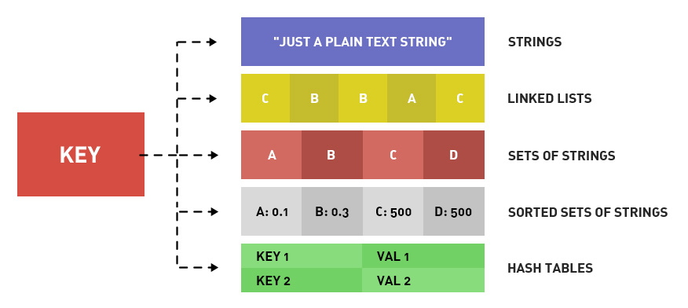

# Redis - 基础数据类型

学会使用 Redis 的一个重要内容就是 Redis 的数据类型，对于开发人员而言，学会 Redis 基础数据类型的使用即可应用到程序开发当中。

<!--more-->

## 简介

根据 [官网文档](https://redis.io/topics/data-types) 的解释，可以了解 Redis 基础数据类型的一些基本信息：

对于 Redis 来说，存储的 key 值都是字符串类型，讨论数据类型的时候，指的都是存储的 value 值。这里主要是包括 5 种数据类型：String、List、Set、Hash、SortedSet。

如果想要了解 Redis 基础数据类型支持的命令，可以查看 [官方文档](https://redis.io/commands)，筛选对应数据类型即可。

## String

String 是最基本的 Redis 数据类型，其是二进制安全的，这表示 String 可以存储任何类型的数据，如字符串、数字、图片、序列化对象等等。

[官方文档](https://redis.io/docs/data-types/strings/) 提供了部分对 String 数据类型的说明，具体 String 数据类型支持的命令也可以通过访问 [这里](https://redis.io/commands/?group=string) 查看。

有一点需要注意，String 数据类型最高支持存储 512MB 长度的数据。

通常情况，String 数据类型会使用在以下场景：

- 数据缓存：直接存储字符串、序列化数据、图片、视频等数据
- 计数器：使用 `INCRBY` 这样的增量命令实现原子计数器
- 分布式锁：使用多参数的 `SET` 命令实现分布式锁

## List

Redis 的 List 数据类型是一个双端链表，因此 List 随机存取的效率比较低，不过可以像使用链表一样实现链式栈、链式队列等功能。

[官方文档](https://redis.io/docs/data-types/lists/) 提供了部分对 List 数据类型的说明，具体 List 数据类型支持的命令也可以通过访问 [这里](https://redis.io/commands/?group=list) 查看。

有一点需要注意，List 数据类型最大支持存储 $2^{32} - 1$(约 42 亿) 个元素。

通常情况，List 数据类型会使用在以下场景：

- 栈：联合使用 `LPUSH` 命令和 `LPOP` 命令即可实现栈
- 队列：联合使用 `LPUSH` 命令和 `RPOP` 命令即可实现队列
- 有限集合：联合使用 `LPUSH` 命令和 `LTRIM` 命令即可实现有限集合
- 消息队列：联合使用 `LPUSH` 命令和 `BRPOP` 命令即可实现延时消息队列

## Set

Set 是一个无序不重复集合，并且现有命令实现集合的交集、并集、差集等功能，但频繁使用这些功能会影响 Redis 服务器的性能，建议谨慎使用。

[官方文档](https://redis.io/docs/data-types/sets/) 提供了部分对 Set 数据类型的说明，具体 Set 数据类型支持的命令也可以通过访问 [这里](https://redis.io/commands/?group=set) 查看。

同 List 数据类型一样，Set 数据类型最大支持存储 $2^{32} - 1$(约 42 亿) 个元素。

通常情况，Set 数据类型会使用在以下场景：

- 标签：不同的标签存储在不同集合中，既可以查询是否存在相同标签，也可以聚合不同标签
- 共同好友：不同用户的好友存储在不同集合中，使用交集可以得到共同好友
- 独立 IP：利用 Set 的元素唯一性，可以快速实时统计网站的独立 IP

## Hash

Redis 的 Hash 数据类型存储着字符串 field 和字符串 value 的映射关系，特别适合存储 key-value 结构。

[官方文档](https://redis.io/docs/data-types/hashes/) 提供了部分对 Hash 数据类型的说明，具体 Hash 数据类型支持的命令也可以通过访问 [这里](https://redis.io/commands/?group=hash) 查看。

每个 Hash 数据类型最多可以存储 $2^{32} - 1$(约 42 亿) 个键值对，实际上，Hash 数据类型仅受 Redis 所部署的内存限制。

通常情况，Hash 数据类型会使用在以下场景：

- 数据缓存：对比于存储 JSON 字符串的 String 类型，Hash 更直观、更节省空间、更灵活

## SortedSet

SortedSet 数据类型有点类似于 Set 数据类型，不同之处在于 SortedSet 数据类型支持按照给定的分数对数据进行排序。

SortedSet 中的集合通过哈希表实现，在实际使用中，添加、删除、查找的效率都非常高。

[官方文档](https://redis.io/docs/data-types/sorted-sets/) 提供了部分对 Hash 数据类型的说明，具体 Hash 数据类型支持的命令也可以通过访问 [这里](https://redis.io/commands/?group=sorted-set) 查看。

大多数 SortedSet 操作的复杂度是 O(log(N))，其中 N 是成员数。部分批量查询命令的时间复杂度可以达到 O(log(N) + M)，这里的 M 是返回的结果数。

通常情况，SortedSet 数据类型会使用在以下场景：

- 排行榜：排行榜需要按照某个规则排序，将这个规则值存储成分数，即可实现排行榜的功能
- 权重队列：通过将任务的权重存储成分数，工作线程可以按照分数的倒序来获取工作任务

## 其他数据类型

Redis 中最常见的数据类型就是 String、List、Set、Hash、SortedSet 这 5 种，也是最初支持的数据类型。

当然，Redis 也有一些不常见、却适用于特殊场景的数据类型，了解这些数据类型也是很必要的。

Stream 是 Redis 5.0 版本新增的数据类型，其本身类似于 append-only 日志。实际上给 Redis 的发布、订阅功能提供了持久化和主备复制功能，可以让任何客户端访问任何时刻的数据，并且能记住每一个客户端的访问位置，还能保证消息不丢失。

Geospatial 是 Redis 3.2 版本新增的数据类型，此类型主要用于存储地理位置信息，并且 Redis 提供了常见的地理位置查询命令。

HyperLogLog 是 Redis 2.8.9 版本新增的数据类型，主要用于做基数统计的算法。其使用不超过 12 KB 的存储，且仅达到 0.81% 的标准错误率，应用场景也是十分特殊。

Bitmap 是 String 数据类型的扩展，是定义在 String 数据类型上的面向位的操作，其最大的优点是当存储信息时可以节省极大的空间。

