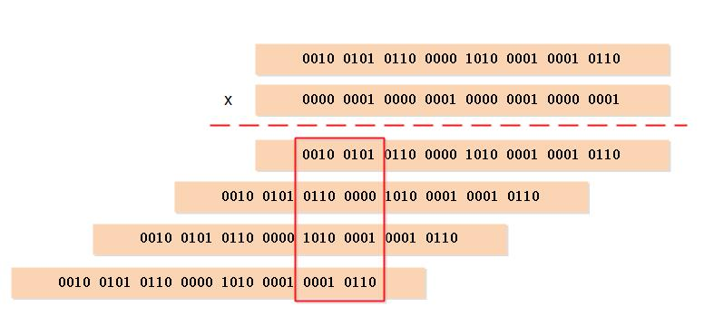

# Redis - 二进制位数组


数学上有一个“计算汉明重量”的问题，即求取一个二进制位中非 0 的数量。使用 Redis 提供的 Bitmap 统计时恰恰是这样一个问题，学习后能发现解决办法却是如此巧妙。

<!--more-->

## 简介

Redis 使用字符串对象来表示位数组，因为字符串对象使用的 SDS 数据结构是二进制安全的，所以程序可以直接使用 SDS 结构来保存位数组，并使用 SDS 结构的操作函数来处理位数组。

在 SDS 结构当中，`buf` 字节数组除了字符串结尾的 `\0` 空字符，其余的位置都存储着一个字节长的位数组，一个字节可以存储 8 位的二进制。

这里需要注意的是，在 `buf` 数组中存储的二进制位数组的顺序与实际书写的顺序相反，比如 `01010101` 存储在 `buf` 数组中的结构是 `10101010` 这样的倒序，使用逆序来保存位数组可以简化 `SETBIT` 的实现。

## 命令使用

Redis 提供了 `GETBIT`、`SETBIT`、`BITCOUNT`、`BITOP`、`BITPOS`、`BITFIELD`、`BITFIELD_RO` 等命令用于处理二进制位数组。

### GETBIT

`GETBIT <bitarray> <offset>` 命令用于返回位数组 `bitarray` 在 `offset` 偏移量上的二进制位的值。其详细执行过程如下：

1. 计算 `byte = offset / 8` 得到 `offset` 偏移量指定的二进制位保存在位数组的哪个字节；
2. 计算 `bit = (offset mod 8) + 1` 得到 `offset` 偏移量指定的二进制位是 `byte` 字节的第几个二进制位；
3. 根据 `byte` 值和 `bit` 值，在位数组 `bitarray` 中定位 `offset` 偏移量指定的二进制位，并返回这个位的值。

### SETBIT

`SETBIT <bitarray> <offset> <value>` 可以看作是 `GETBIT` 的反向操作，只是需要注意设置二进制位时有可能需要扩展 `buf` 数组的长度。

具体的执行过程如下：

1. 计算 `len = (offset / 8) + 1` 得到保存 `offset` 偏移量指定的二进制位需要多少字节；
2. 检查 `bitarray` 位数组的长度是否满足要求，否则需要对 SDS 的进行扩展，并且将新增的二进制位全部置为 0；
3. 计算 `byte = offset / 8` 得到 `offset` 偏移量指定的二进制位保存在位数组的哪个字节；
4. 计算 `bit = (offset mod 8) + 1` 得到 `offset` 偏移量指定的二进制位是 `byte` 字节的第几个二进制位；
5. 根据 `byte` 值和 `bit` 值，在位数组 `bitarray` 中定位 `offset` 偏移量指定的二进制位，首先将这个位现在的值保存在 `oldvalue` 变量中，然后将新值 `value` 设置为这个二进制位的值；
6. 向客户端返回 `oldvalue` 的值。

由于 `buf` 数组使用逆序保存位数组，当 Redis 对 `buf` 数组进行扩展之后，写入操作都可以直接在新扩展的二进制位中完成，而不必改动位数组原来已有的二进制位。

### BITCOUNT

`BITCOUNT key [start] [end]` 命令用于统计给定位数组中，值为 1 的二进制位的数量。

### BITOP

`BITOP operation destkey key [key ...]` 支持对一个或多个保存二进制位的字符串 key 进行位元操作，并将结果保存到 destkey 上。`operation` 可以是 `AND` 、 `OR` 、 `NOT` 、 `XOR` 这四种操作中的任意一种：

- `AND`: 逻辑与
- `OR`: 逻辑或
- `NOT`: 逻辑非
- `XOR`: 逻辑异或

因为 `BITOP AND`、`BITOP OR`、`BITOP XOR` 三个命令可以接受多个位数组作为输入，程序需要遍历输入的每个位数组的每个字节来进行计算，所以这些命令的复杂度为 $O(n^2)$；与此相反，因为 `BITOP NOT` 命令只接受一个位数组输入，所以它的复杂度为 $O(n)$。

### BITPOS

`BITPOS key bit [start [end [BYTE | BIT]]]` 返回字符串中设置为 1 或 0 的第一个位的位置。

默认情况下，整个字符串都会被检索一遍。命令的

使用 `start` 和 `end` 参数默认可以指定一个字节的范围，在 7.0.0 版本之后，提供了 `BYTE` 和 `BIT` 指定以字节为范围还是位为范围。

## 二进制位统计算法

`BITCOUNT` 命令要做的工作初看上去并不复杂，但实际上要高效地实现这个命令并不容易，需要用到一些精巧的算法。

### 遍历算法

实现 `BITCOUNT` 命令最简单直接的方法，就是遍历位数组中的每个二进制位，并在遇到值为 1 的二进制位时，将计数器的值增一。

遍历算法虽然实现起来简单，但效率非常低，因为这个算法在每次循环中只能检查一个二进制位的值是否为 1，所以检查操作执行的次数将与位数组包含的二进制位的数量成正比。

### 查表算法

查表算法就是创建一个表，表的键为某种排列的位数组，而表的值则是相应位数组中值为 1 的二进制位的数量。

创建了这种表之后，就可以根据输入的位数组进行查表，在无须对位数组的每个位进行检查的情况下，直接知道这个位数组包含了多少个值为 1 的二进制位。

初看起来，只要创建一个足够大的表，那么统计工作就可以轻易地完成，但这个问题实际上并没有那么简单，因为查表法的实际效果会受到内存和缓存两方面因素的限制：

- 查表法是典型的空间换时间策略，算法在计算方面节约的时间是通过花费额外的内存换取而来的，节约的时间越多，花费的内存就越大。
- 查表法的效果还会受到 CPU 缓存的限制，对于固定大小的 CPU 缓存来说，创建的表格越大，CPU 缓存所能保存的内容相比整个表格的比例就越少，查表时出现缓存不命中的情况就会越高，缓存的换入和换出操作就会越频繁，最终影响查表法的实际效率。

### variable-precision SWAR 算法

`BITCOUNT` 命令要解决统计一个位数组中非 0 二进制位的数量的问题，在数学上被称为“计算汉明重量（Hamming Weight）”。目前已知效率最好的通用算法为 variable-precision SWAR 算法，该算法通过一系列位移和位运算操作，可以在常数时间内计算多个字节的汉明重量，并且不需要使用任何额外的内存。

以下是一个处理 32 位长度位数组的 variable-precision SWAR 算法的实现：

```c
uint32_t swar(uint32_t i){
    i = (i & 0x55555555) + ((i>>1) & 0x55555555);  // 步骤 1
    i = (i & 0x33333333) + ((i>>2) & 0x33333333);  // 步骤 2
    i = (i & 0x0F0F0F0F) + ((i>>4) & 0x0F0F0F0F);  // 步骤 3
    i = (i - 0x01010101) >> 24;                    // 步骤 4
    return i;
}
```

variable-precision SWAR 算法实质上是通过分而治之的思想，将计算拆解成多个小问题去解决：

1. 步骤 1 是将 32 位数组与 `01010101010101010101010101010101` 做逻辑与操作，并且右移 1 位之后继续做逻辑与操作，最终取它们的和。这一步的想法是将 32 位拆成每 2 位作为一个组合，统计出每一组中 1 的个数；
2. 步骤 2 是将上述得到的结果与 `00110011001100110011001100110011` 做逻辑与操作。这一步的想法就是拆成每 4 位作为一个组合，统计出每一组中 1 的个数；
3. 步骤 3 是将上述得到的结果与 `00001111000011110000111100001111` 做逻辑与操作。这一步的想法就是拆成每 8 位作为一个组合，统计出每一组中 1 的个数；
4. 上述的结果仍然不是最终想要的结果，步骤 4 就是将上述得到的数字计算出 1 真正的数量。`i - (0x01010101)` 计算出汉明重量并记录在二进制的高八位，`>> 24` 语句则通过右移运算，将汉明重量移到最低八位，最后二进制对应的十进制就是汉明重量。



因为 variable-precision SWAR 算法是一个常数复杂度的操作，所以可以按照自己的需要，在一次循环中多次执行 variable-precision SWAR 算法，从而按倍数提升计算汉明重量的效率。

当然，在一个循环里执行多个 variable-precision SWAR 算法调用这种优化方式是有极限的：一旦循环中处理的位数组的大小超过了缓存的大小，这种优化的效果就会降低并最终消失。

### Redis 的实现

`BITCOUNT` 命令的实现用到了查表和 variable-precision SWAR 两种算法：

- 如果未处理处理的二进制位的数量小于 128 位，那么程序使用查表算法来计算二进制位的汉明重量，表中记录了 0x00 ~ 0xFF 在内的所有二进制位的汉明重量
- 如果未处理的二进制位的数量大于等于 128 位，那么程序使用 variable-precision SWAR 算法来计算二进制位的汉明重量，每次处理 128 个二进制位，调用 4 次 32 位 variable-precision SWAR 算法来计算其汉明重量

实际上 `BITCOUNT` 命令实现的算法复杂度为 $O(n)$，其中 n 为输入二进制位的数量。

