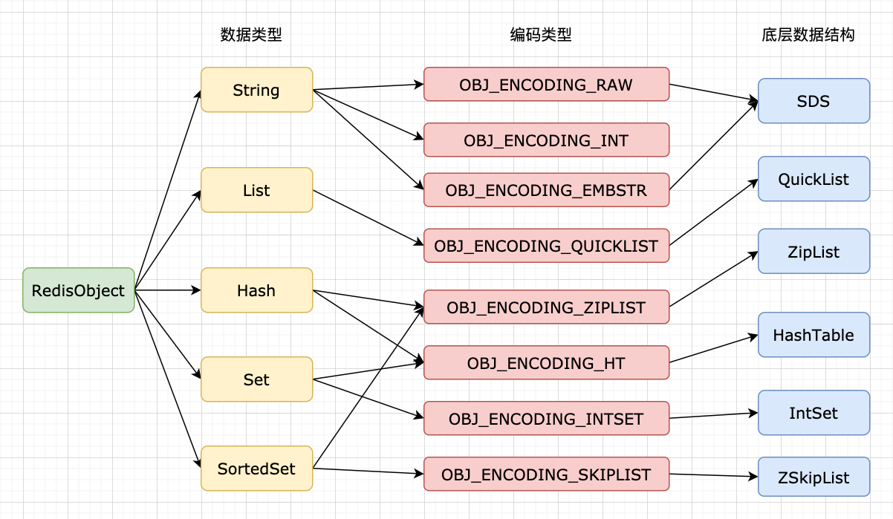

# Redis - 数据类型映射底层结构

Redis 作为一个成熟的内存型数据库，对于内存占用和操作性能上会有自己的取舍，通过这些知识可以理解为什么 Redis 的性能有时候会变化得那么快。

<!--more-->

## 简介

从数据类型上体现就是，同一个数据类型，在不同的情况下会使用不同的编码类型，底层所使用的的数据结构也不相同。

## 字符串对象

字符串对象的编码可以是 `int`、`raw` 和 `embstr` 三者之一。

`embstr` 编码是专门用于保存简短字符串的一种优化编码方式，与 `raw` 编码会调用两次内存分配函数分别创建 `redisObject` 结构和 `sdshdr` 结构不同，`embstr` 只会使用一次内存分配函数创建一块连续的内存空间同时存放 `redisObject` 结构和 `sdshdr` 结构。

字符串转换编码的条件如下：

- 如果字符串对象存储的是整数值并且不超过 `long` 的范围时，优先选择使用 `int` 作为编码方式
- 如果存储的字符串长度大于 32 个字节，会使用 `raw` 编码的简单动态字符串作为保存
- 如果存储的字符串长度小于 32 个字节，会使用 `embstr` 编码的简单动态字符串作为保存

字符串对象中有两个需要注意的地方：

- 对于存储浮点数的字符串对象，实际上这个浮点数是以字符串值来保存的，执行如 `INCRBYFLOAT` 这样的命令时，Redis 会先将字符串转换成浮点数计算，然后再转换成字符串值存储
- `int` 编码和 `embstr` 编码在条件满足下会转换成 `raw` 编码。`embstr` 在执行修改命令之后总是会转换成 `raw` 编码，这个过程是不可逆的

## 列表对象

在 3.2 版本之前，列表对象的编码可以是 `ziplist` 或者 `zlinkedlist` 的其中一个；在 3.2 版本之后，列表对象的编码只能是 `quicklist`。

## 哈希对象

哈希对象的编码可以是 `ziplist` 或者 `hashtable` 中的一个。

哈希对象使用 `ziplist` 作为底层实现的时候，每当有新的键值对要插入哈希对象时，Redis 会先保存键的压缩列表节点到压缩列表的表尾，然后再保存值的压缩列表节点到压缩列表的表尾。

当哈希对象同时满足以下两个条件时，哈希对象使用 `ziplist` 编码：

- 哈希对象保存的所有键值对的键和值的字符串长度都小于 64 字节
- 哈希对象保存的键值对数量小于 512 个

## 集合对象

集合对象的编码可以是 `intset` 或者 `hashtable` 中的一个。

`hashtable` 编码的集合对象使用字典作为底层实现，字典的每个键都是字符串对象，这个字符串对象包含着集合元素，字典的每个值都直接存储 `NULL`。

当集合对象同时满足以下两个条件时，集合对象使用 `intset` 编码：

- 集合对象保存的所有元素都是整数值
- 集合对象保存的元素数据不超过 512 个

## 有序集合对象

有序集合对象的编码可以是 `ziplist` 或者 `skiplist` 中的一个。

有序集合对象使用 `ziplist` 编码作为底层实现时，每个集合对象会使用两个紧挨在一起的压缩列表节点来保存，第一个节点保存元素的成员，第二个元素则保存元素的分值。

这里有一点需要注意，`skiplist` 编码的有序集合使用 `zset` 结构作为底层实现，一个 `zset` 结构包含一个字典和一个跳表。其中字典的键保存元素的成员，字典的值保存元素的分值；跳表的 `object` 属性保存元素的成员，跳表的 `score` 属性保存元素的分值。

理论上有序集合可以只使用字典或者跳表实现，但是使用两个结构冗余存储有序集合对象的成员和分值，既保留了字典 $O(1)$ 时间复杂度查找的效率，也保留了跳表范围型操作的所有优点。

当同时满足以下两个条件时，有序集合会使用 `ziplist` 编码：

- 有序集合保存的元素数量小于 128 个
- 有序集合保存的所有元素成员的长度都小于 64 字节

