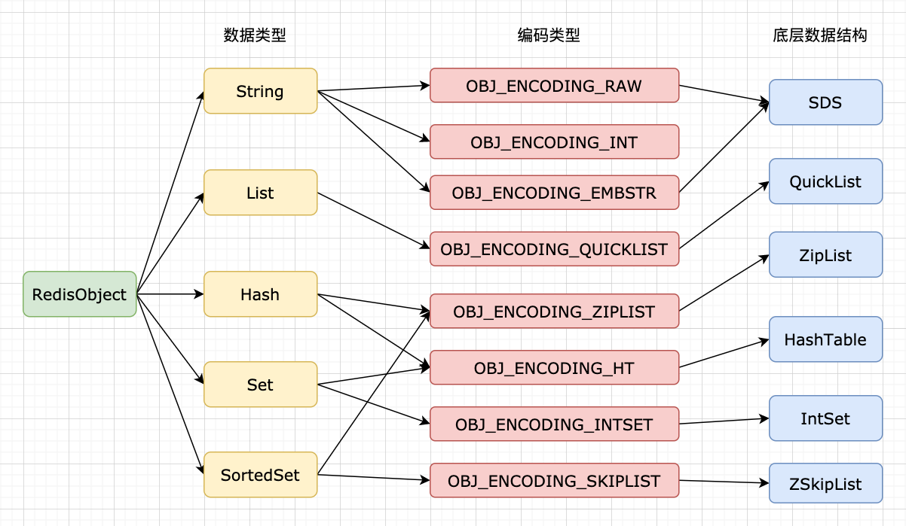

# Redis - 对象结构


其实，Redis 的每种对象都有对象结构与对应编码的数据结构组合而成，进阶 Redis 就需要从它的对象机制开始。

<!--more-->

## 简介

Redis 使用对象存储数据库中的键和值，每当在 Redis 中创建一个新的键值对时，都会创建两个对象：一个是键对象，另一个是值对象。



其中，Redis 的每种对象都由对象结构和对应编码的数据结构组合而成，而每种对象类型对应若干编码方式，不同编码方式对应的底层数据结构也会有所不同。

## 数据库结构

Redis 服务器的数据库都保存在 `redisServer` 的 `db` 数组中，数组中的每个项都是 `redisDb` 结构，每个 `redisDb` 结构代表一个数据库。

下面是部分 `redisServer` 结构：

```c
struct redisServer {
    redisDb *db;    // 保存数据库的数组
    int dbnum;      // 服务器的数据库数量
    // ...
};
```

其中，初始化服务器时，会根据 `dbnum` 的值决定创建多少个数据库。默认情况下，`dbnum` 的值是 16。

### 切换数据库

默认情况下，Redis 客户端的目标数据库是 0 号数据库，但是客户端可以使用 `SELECT` 命令切换目标数据库。

需要注意的是，Redis 现在没有向客户端返回目标数据库的命令，对数据库进行误操作极易出现不符合预期的情况，尤其是像 `FLUSHDB` 这样的命令。

比较好的做法是尽量少地在代码中切换数据库，即使是在命令行操作，也尽量显式地切换到指定的数据库，然后再执行命令。

### 数据库键空间

每一个数据库中都存储了一个字典，这个字典存储了数据库中的所有键值对，这个字典又被称为键空间。

所有对数据库中键值对的增删查改操作，实际上都是在操作键空间字典。

只是，由于数据库可以存储多种不同的数据结构类型，这些增删查改操作，都会使用对应数据结构提供的函数执行。

### 读写键空间的维护操作

当使用 Redis 命令对键空间字典进行读写操作时，服务器不仅会执行这些读写操作，还会做一些维护性的操作，提高 Redis 的可用性，其中包括：

- 读取一个键时，服务器会根据键是否存在来更新键空间命中次数和不命中次数
- 读取到一个键之后，服务器会更新这个键的 `lru` 属性
- 如果服务器读取到键之后，发现这个键已经过期，会先删除这个键，再执行后续的操作
- 如果有客户端使用 `WATCH` 命令监视这个键，服务器修改这个键之后，会将这个键标记为 dirty 状态
- 服务器每次修改一个键之后，都会对脏计数器的值增 1，这个计数器会触发服务器的持久化或复制操作
- 如果服务器开启了通知功能，那么对这个键做修改操作之后，服务器将按配置发送对应的数据库通知

## 类型与编码

Redis 中的每个对象都是由一个 `redisObject` 结构表示，其结构如下：

```c
typedef struct redisObject {
    unsigned type:4;        // 类型
    unsigned encoding:4;    // 编码
    unsigned lru:LRU_BITS;  // 记录最后访问的时间
    int refcount;           // 引用计数
    void *ptr;              // 指向底层实现数据结构的指针
} robj;
```

其中 `type`、`encoding` 和 `ptr` 是最重要的三个属性。

### 数据类型

对象的 `type` 属性记录了数据结构的类型，它总是以下枚举值之一：

- `REDIS_STRING`
- `REDIS_LIST`
- `REDIS_HASH`
- `REDIS_SET`
- `REDIS_ZSET`

### 对象编码

对象的 `encoding` 属性记录了 `ptr` 指针指向对象的编码方式，它总是以下枚举值之一：

- `OBJ_ENCODING_RAW`
- `OBJ_ENCODING_INT`
- `OBJ_ENCODING_HT`
- `OBJ_ENCODING_ZIPMAP`
- `OBJ_ENCODING_LINKEDLIST`
- `OBJ_ENCODING_ZIPLIST`
- `OBJ_ENCODING_INTSET`
- `OBJ_ENCODING_SKIPLIST`
- `OBJ_ENCODING_EMBSTR`
- `OBJ_ENCODING_QUICKLIST`
- `OBJ_ENCODING_STREAM`

通过使用 `encoding` 属性设定对象的编码方式，而不是使用固定编码，这样极大地提高了 Redis 的灵活性和效率，也方便 Redis 针对不同的场景选择不同的编码，针对性地做优化。

### 对象指针

对象的 `ptr` 属性是一个指针，指向实际保存值的数据结构。

### 空转时间

对象的 `lru` 属性记录了对象最后一次被命令程序访问的时间。空转时间指的是当前时间减去 `lru` 属性得到的时长，即未被访问的时长。

键的空转时间在内存回收算法是 `volatile-lru` 或 `allkeys-lru` 时使用到，当服务器占用的内存超过了 `maxmemory` 之后，空转时长较高的那部分键会优先被服务器释放，从而回收内存。

## 命令执行流程

Redis 中用于操作键的命令分为两类：任何类型的键都可以执行的命令、针对特定类型的键可执行的命令。例如 `DEL`、`EXPIRE` 等命令属于前者，`SET`、`HSET` 等命令属于后者。

针对特定类型的键的执行命令，执行前需要检查键的类型，确定当前键是否可执行当前命令。

在 Redis 中，一个数据类型有可能对应多个编码方式，在检查完键的类型之后，还需要根据数据类型的不同编码进行多态处理。

因此，当处理一个特定类型命令的时候，执行的步骤如下：

- 根据给定的 key 名称，在数据库字典中查找相对应的 Redis 对象，如果没有找到，返回 `NULL` 值
- 检查 Redis 对象中的 `type` 属性和执行命令所需的类型是否相符，如果不相符，返回类型错误
- 根据 Redis 对象中的 `encoding` 属性选择合适的操作函数来处理底层数据结构
- 将操作函数的返回值作为命令请求的响应返回给客户端

## 对象共享

目前，为了解决重复分配的麻烦，Redis 会在初始化服务器时创建一万个字符串对象，这些对象包含了从 0 到 9999 的所有整数值，当服务器需要用到值为 0 到 9999 的字符串对象时，服务器就会使用这些共享对象，而不是创建新的对象。

尽管共享更复杂的对象可以节约更多的内存，但受到 CPU 时间的限制，Redis 只对包含整数值的字符串对象进行共享。

需要注意的是，共享对象只能被字典和双向链表这类能带有指针的数据结构使用。

## 内存回收

因为 C 语言并不具备自动内存回收功能，所以 Redis 在自己的对象系统中构建了一个引用计数技术实现内存回收机制。通过这个内存回收机制，Redis 可以通过对象的引用计数信息，在适当的时候自动释放对象并进行内存回收。

对象的引用计数信息通过 `refcount` 属性记录，其使用如下：

- 当创建新对象时，引用计数的值会初始化为 `1`
- 当这个对象被共享时，引用计数的值会自增
- 当使用完一个对象后，或者消除对这个对象的引用之后，引用计数的值会自减
- 当对象的引用计数值变为 `0` 时，对象所占用的内存会被释放

