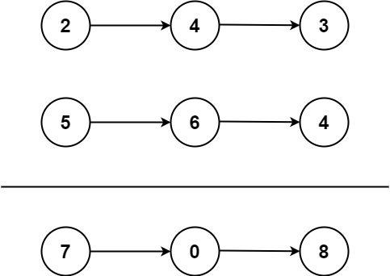

<!--more-->

## 题目信息

源地址：[两数相加](https://leetcode.cn/problems/add-two-numbers/)

给你两个 非空 的链表，表示两个非负的整数。它们每位数字都是按照 逆序 的方式存储的，并且每个节点只能存储 一位 数字。

请你将两个数相加，并以相同形式返回一个表示和的链表。

你可以假设除了数字 0 之外，这两个数都不会以 0 开头。

## 提示信息

### 示例 1



```plaintext
输入：l1 = [2,4,3], l2 = [5,6,4]
输出：[7,0,8]
解释：342 + 465 = 807
```

### 示例 2

```plaintext
输入：l1 = [0], l2 = [0]
输出：[0]
```

### 示例 3

```plaintext
输入：l1 = [9,9,9,9,9,9,9], l2 = [9,9,9,9]
输出：[8,9,9,9,0,0,0,1]
```

### 提示

- 每个链表中的节点数在范围 `[1, 100]` 内
- `0 <= Node.val <= 9`
- 题目数据保证列表表示的数字不含前导零

## 实现逻辑

### 结点累加

这道题目将两个链表结合成一个链表，比较清晰的思路就是，类似于四则运算中的加法，从个位往高位进行每一位相加，如果当前位的结果大于等于 10 时则需要在高位加 1。

解析到程序当中，既可以使用循环的方式，也可以使用递归的思维。循环的方式是将两个链表同步递增，而递归的方式是每次计算完一位时再对链表的下一个结点做递归处理。

通过循环的方式解决这个问题，时间复杂度是 $O(n)$，空间复杂度也是 $O(n)$，这里的 n 指的是最长的那个链表节点数。

```java
package cn.fatedeity.algorithm.leetcode;

public class AddTwoNumbers {
    public ListNode answer(ListNode l1, ListNode l2) {
        ListNode result = new ListNode();
        ListNode listNode = result;
        boolean addOne = false;
        while (l1 != null || l2 != null || addOne) {
            int sum = 0;
            if (l1 != null) {
                sum += l1.val;
                l1 = l1.next;
            }
            if (l2 != null) {
                sum += l2.val;
                l2 = l2.next;
            }
            if (addOne) {
                sum += 1;
            }
            addOne = sum >= 10;
            listNode.next = new ListNode(sum % 10);
            listNode = listNode.next;
        }
        return result.next;
    }
}

class ListNode {
    int val;
    ListNode next;

    ListNode() {
    }

    ListNode(int val) {
        this.val = val;
    }

    ListNode(int val, ListNode next) {
        this.val = val;
        this.next = next;
    }
}
```

