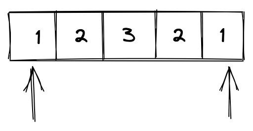

# LeetCode - 回文数


<!--more-->

## 题目信息

源地址：[回文数](https://leetcode.cn/problems/palindrome-number/)

给你一个整数 `x`，如果 `x` 是一个回文整数，返回 `true`；否则，返回 `false`。

回文数是指正序（从左向右）和倒序（从右向左）读都是一样的整数。

例如，`121` 是回文，而 `123` 不是。

## 提示信息

### 示例 1

```
输入：x = 121
输出：true
```

### 示例 2

```
输入：x = -121
输出：false
解释：从左向右读, 为 -121 。 从右向左读, 为 121- 。因此它不是一个回文数。
```

### 示例 3

```
输入：x = 10
输出：false
解释：从右向左读, 为 01 。因此它不是一个回文数。
```

### 提示

- `-2^31 <= x <= 2^31 - 1`

## 实现逻辑

### 双指针

比较简单的思路就是，先将整数转换成字符串，然后使用首尾双指针判断所指位置的字符是否相同，直到所有的字符都被比较完毕。



如上图所示，使用双指针是比较直观的一个思路，需要注意的就是，负整数都不是回文数，奇数和偶数在做回文判断时有区别。

```java
package cn.fatedeity.algorithm.leetcode;

public class PalindromeNumber {
    public boolean answer(int x) {
        if (x < 0) {
            return false;
        }
        // 转成字符串
        String s = Integer.toString(x);
        // 双指针判断
        int len = s.length();
        for (int i = 0; i < len >> 1; i++) {
            if (i != len - 1 - i && s.charAt(i) != s.charAt(len - 1 - i)) {
                return false;
            }
        }
        return true;
    }
}
```

### 不转换成字符串

如果给这道题目加上不能将整数转换为字符串的限制，就需要在数学的角度上去思考其解决方案。

既然是想要判断整数是否是回文，则可以直接将整数翻转成另一个整数，再将这两个整数做相等匹配，此方法的循环次数相比双指针更多，但却没有整数转换成字符串的耗时，整数效率更高一些。

```java
package cn.fatedeity.algorithm.leetcode;

public class PalindromeNumber {
    public boolean answer(int x) {
        if (x < 0) {
            return false;
        }
        // 将整数进行翻转
        int reverse = 0;
        int rest = x;
        while (rest >= 10) {
            reverse = reverse - 10 + rest % 10;
            rest = (int) (rest / 10.0);
        }
        return reverse - 10 + rest == x;
    }
}
```

