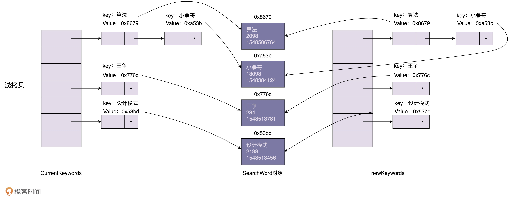
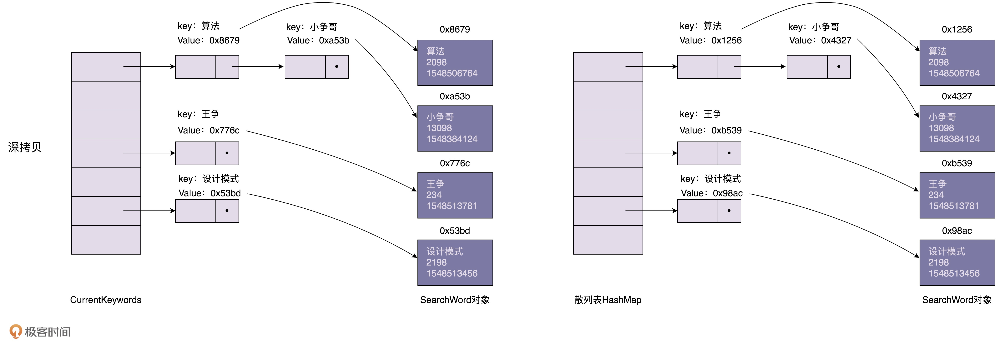

原型模式是创建型模式的一种，其特点在于通过 **复制** 一个已经存在的实例来返回新的实例,而不是新建实例。

<!--more-->

## 简介

对于大部分系统来说，创建对象包括申请内存、给成员变量赋值等过程，这些操作耗费的时间基本可以忽略不计。

如果对象中的数据需要经过复杂的计算才能得到（比如排序、计算哈希值），或者需要从 RPC、网络、数据库、文件系统等非常慢速的 IO 中读取，这其中耗费的时间有时是无法容忍的。

如果对象的创建成本比较大，而同一个类的不同对象之间差别不大（如大部分字段都相同），在这种情况下，可以利用对已有对象（原型）进行复制的方式来创建新对象，以达到节省创建时间的目的。

这种基于原型来创建对象的方式就叫作原型设计模式（Prototype Design Pattern）。

## 具体实现

原型模式其核心就是拷贝，而在编程语言中，拷贝有两种实现方式：深拷贝和浅拷贝。

### 浅拷贝



浅拷贝只会复制对象中基本数据类型和引用对象的内存地址，不会递归地复制引用对象，以及引用对象的引用对象……

对于浅拷贝来说，如果要拷贝的对象是不可变对象，浅拷贝共享不可变对象是没问题的，但是对于可变对象来说，浅拷贝得到的对象和原始对象会共享部分数据，就有可能出现数据被修改的风险。

### 深拷贝



和浅拷贝不同，深拷贝得到的是一份完完全全独立的对象，相比浅拷贝，深拷贝更加耗时、更加耗内存空间。

常见的深拷贝有两种实现方式：递归浅拷贝对象直到只包含基本数据类型数据；序列化对象再反序列化成新的对象。实际开发中更推荐使用后者。

递归浅拷贝的 Java 代码示例如下：

```java
public class DeepProtoType implements Cloneable {
    // String 类型
    public String name;
    // 引用数据类型
    public DeepCloneableTarget deepCloneableTarget;

    public DeepProtoType() {
        super();
    }

    @Override
    protected Object clone() throws CloneNotSupportedException {
        Object deep = null;
        // 这里完成对基本数据类型（属性）和 String 类型的拷贝
        deep = super.clone();
        // 对引用数据类型的属性进行单独处理，如果有多属性，需要一一处理
        DeepProtoType deepProtoType = (DeepProtoType)deep;
        deepProtoType.deepCloneableTarget = (DeepCloneableTarget)deepCloneableTarget.clone();

        return deepProtoType;
    }
}
```

序列化对象的代码示例如下：

```java
public class DeepProtoType implements Serializable {
    // String 类型
    public String name;
    // 引用数据类型
    public DeepCloneableTarget deepCloneableTarget;

    public DeepProtoType() {
        super();
    }

    public Object deepClone() {
        // 创建流对象
        ByteArrayOutputStream bos = null;
        ObjectOutputStream oos = null;
        ByteArrayInputStream bis = null;
        ObjectInputStream ois = null;

        try {
            // 序列化
            bos = new ByteArrayOutputStream();
            oos = new ObjectOutputStream(bos);
            // 当前这个对象以对象流的方式输出
            oos.writeObject(this);

            // 反序列化
            bis = new ByteArrayInputStream(bos.toByteArray());
            ois = new ObjectInputStream(bis);
            DeepProtoType deepProtoType = (DeepProtoType) ois.writeObject();

            return deepProtoType;
        } catch (Exception e) {
            e.printStackTrace();
            return null;
        } finally {
            try {
                bos.close();
                oos.close();
                bis.close();
                ois.close();
            } catch (Exception e2) {
                System.out.println(e2.getMessage());
            }
        }
    }
}
```

## 总结

### 优点

原型模式的主要优点如下：

- 当创建新的对象实例较为复杂时，使用原型模式可以简化对象的创建过程，通过复制一个已有实例可以提高新实例的创建效率
- 可以使用深拷贝方式保存对象的状态，使用原型模式将对象复制一份，并将其状态保存起来
- 原型模式提供了简化的创建结构

### 缺点

原型模式的主要缺点如下：

- 需要为每一个类都配置一个拷贝方法
- 拷贝方法位于类的内部，当对已有类进行改造的时候，需要修改代码，违背了开闭原则
- 当实现深拷贝的时候，需要编写较为复杂的代码，而且当对象之间存在多重嵌套引用时，为了实现深拷贝，每一层对象对应的类都必须支持深拷贝

### 适用场景

原型模式的适用场景如下：

- 创建对象的成本较大，比如初始化时间长，占用 CPU 太多，或者占用网络资源太多等
- 如果系统要保存对象的状态，而对象的状态变化很小，或者对象本身占用内存较小时，可以使用原型模式配合备忘录模式来实现
- 如果产生一个对象需要非常繁琐的数据准备和访问权限，需要提高权限或提高安全性

### 源码

在 JDK 中，对自定义的类重写 `clone()` 方法就是典型的原型模式。

