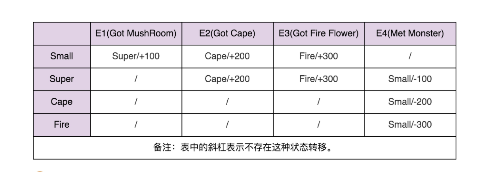

# 初识设计模式 - 状态模式


顾名思义，状态模式用于解决系统中与状态相关的问题，如复杂对象的状态转换以及不同状态下行为的封装问题。

<!--more-->

## 简介

状态模式（State Design Pattern）的定义是，允许一个对象在内部状态改变时改变它的行为，对象看起来似乎修改了它的类。

在状态模式中，通常有两种方式实现状态转换：统一由环境类来负责状态之间的转换；由具体状态类来负责状态之间的转换。

## 状态机

### 概念

状态模式一般用于实现状态机，而状态机常用在游戏、工作流引擎等系统开发中。状态机的实现方式有多种，除了状态模式，比较常用的还有分支逻辑法和查表法。

状态机会有 3 个组成部分：状态（State）、事件（Event）、动作（Action）。

拿“超级马里奥”游戏来举例，其中马里奥形态的转变就是一个状态机：初始状态是小马里奥，吃蘑菇这个事件会触发状态的转移，从小马里奥转变成超级马里奥，以及触发动作的执行（增加积分）。

### 分支逻辑法

最简单的状态机实现方式就是分支逻辑法，其理解非常简单，就是将每一个状态转移都直译成代码。

其缺点是，代码中会充斥着 if-else 或 switch 分支判断逻辑，甚至是嵌套的分支判断逻辑，当状态较多时，代码的可读性会比较低。

### 查表法

查表法的实现逻辑是，将状态、事件和动作三者存储到一个二维表中，这样可以清晰地表示，一个动作发生某个事件时，会转移到怎样的状态以及触发怎样的动作。



在实现过程中，将二维表的数据存储到配置文件中，可以通过动态地修改配置文件以达到修改状态机的目的。

## 具体实现

仍然还是拿“超级马里奥”游戏来举例说明，初始状态是小马里奥，吃蘑菇这个事件会触发状态的转移，从小马里奥转变成超级马里奥，以及触发动作的执行（增加积分）。

首先，定义一个抽象状态 `State` 接口，其代码示例如下：

```java
public interface State {
    // 声明抽象业务方法，不同的具体状态可以有不同的方法实现
    void handle();
}
```

对于小马里奥状态，定义一个实现 `State` 接口的 `SmallState` 类，其代码示例如下：

```java
public class SmallState implements State {
    @Override
    public void handle() {
        // 业务方法的具体实现
        System.out.println("变成小马里奥状态");
    }
}
```

对于超级马里奥状态，定义一个实现 `State` 接口的 `SuperState` 类，其代码示例如下：

```java
public class LargeState implements State {
    @Override
    public void handle() {
        // 业务方法的具体实现
        System.out.println("变成超级马里奥状态");
    }
}
```

在状态模式中，需要创建一个 `Context` 类用于保存对于一个具体状态对象的引用，并且负责状态的保持和转变。其代码示例如下：

```java
public class Context {
    private State state;

    public void setState(State state) {
        // 注入状态对象
        this.state = state;
    }

    public void request() {
        // 调用状态对象的业务方法
        this.state.handle();
    }
}
```

对于客户端，直接操作 `Context` 对象并根据状态的转变传入不同的状态对象，这样即可实现状态机的功能，其代码示例如下：

```java
class StateDemo {
    public static void main(String[] args) {
        Context context = new Context();

        State smallState = new SmallState();
        context.setState(smallState);
        // 变成小马里奥状态
        context.request();

        State largeState = new LargeState();
        context.setState(largeState);
        // 变成超级马里奥状态
        context.request();
    }
}
```

## 总结

### 优点

状态模式的主要优点如下：

- 状态模式统一封装了状态的转换规则，对状态转换代码进行集中管理
- 将不同的状态引入独立的对象中使得状态转换变得更加明确，且减少对象间的相互依赖
- 状态的职责分明，通过定义新的子类可以很容易地增加新的状态和转换

### 缺点

状态模式的主要缺点如下：

- 每个状态都会新增一个具体的状态子类，导致系统的运行开销增大
- 状态模式的结构和实现都较为复杂，使用不当会导致程序结构和代码的混乱
- 对于可以切换的状态模式，增加新的状态类需要修改那些负责状态转换的源码，否则无法切换到新增的状态，而且修改某个状态类的行为也要修改对应类的源码

### 适用场景

状态模式的适用场景如下：

- 对象的行为依赖于它的状态，状态的改变将导致行为的变化
- 在代码中包括大量与对象状态有关的条件语句

